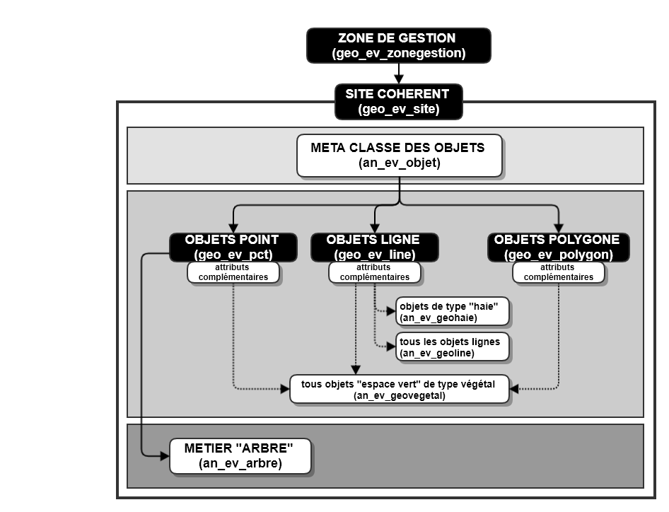
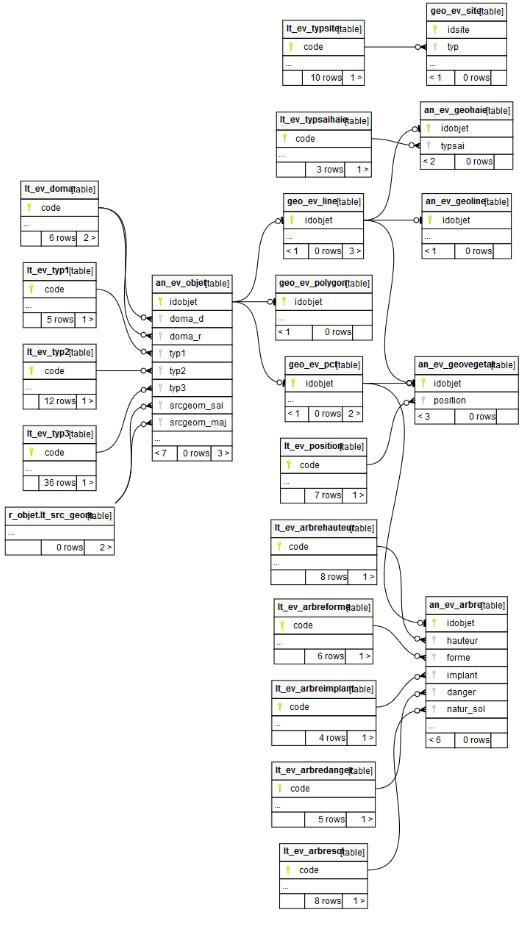

# Documentation d'administration de la base de données des espaces verts #

## Généralité
 
La démarche s'organise en 3 temps :
* inventorier cartographiquement
* spécifier les objets d'un point de vue métier
* exploiter et gérer les données de façon autonome par le(s) service(s) concerné(s) (tableau de bord, gestion et intervention).

## Principe de la modélisation des classes d'objets

## Modèle relationnel simplifié

## Schéma fonctionnel

(à venir)

## Dépendances

La base de données des espaces verts s'appuie sur des référentiels préexistants constituant autant de dépendances nécessaires pour l'implémentation de la base PEI.

|schéma | table | description | usage |
|:---|:---|:---|:---|   
|r_objet|lt_src_geom|domaine de valeur générique d'une table géographique|source du référentiel de saisies des objets|

---

## Classes d'objets

L'ensemble des classes d'objets unitaires sont stockées dans le schéma m_espace_vert, celles dérivées et applicatives dans le schéma `x_apps`, celles dérivées pour les exports opendata dans le schéma `x_opendata`.

### Classe d'objet géographique et patrimoniale

`an_ev_objet` : table alphanumérique des métadonnées des objets des espaces verts.

|Nom attribut | Définition | Type  | Valeurs par défaut |
|:---|:---|:---|:---|  
|idobjet|Identifiant unique de l'objet|bigint||
|idzone|Identifiant de la zone de gestion, intervention d'appartenance|integer||
|idsite|Identifiant du site de production cartographique d'appartenance|integer||
|idcontrat|Identifiant du contrat s'appliquant à l'objet (non encore opérationnel à ce jour)|character varying(2)||
|insee|Code insee de la commune d'appartenance|character varying(5)|valeur vide interdite|
|commune|Libellé de la commune d'appartenance|character varying(80)|valeur vide interdite|
|quartier|Libellé du quartier de la ville de Compiègne d'appartenance|character varying(80)||
|doma_d|Domanialité déduite|character varying(2)|00 (liste de valeurs `lt_ev_doma`)|
|doma_r|Domanialité réelle|character varying(2)|00 (liste de valeurs `lt_ev_doma`)|
|typ1|Valeur de la nomenclature de niveau 1 décrivent l'objet "espace vert"|character varying(1)|valeur vide interdite (liste de valeurs `lt_ev_typ1` attribut `code`)|
|typ2|Valeur de la nomenclature de niveau 2 décrivent l'objet "espace vert"|character varying(2)|valeur vide interdite (liste de valeurs `lt_ev_typ3` attribut `code`)|
|typ3|Valeur de la nomenclature de niveau 3 décrivent l'objet "espace vert"|character varying(3)|valeur vide interdite (liste de valeurs `lt_ev_typ3` attribut `code`)|
|srcgeom_sai|Référentiel de saisies utilisé pour la production initiale cartographique|character varying(2)|00 (liste de valeurs `lt_src_geom`)|
|srcdate_sai|Année du référentiel de saisies utilisé pour la production initiale cartographique|integer||
|srcgeom_maj|Référentiel de saisies utilisé pour la mise à jour de la production cartographique|character varying(2)|00 (liste de valeurs `lt_src_geom`)|
|srcdate_maj|Année du référentiel de saisies utilisé pour la mise à jour de la production cartographique|integer||
|op_sai|Opérateur de saisie initial de l'objet|character varying(50)|valeur vide interdite|
|op_maj|Opérateur ayant mis à jour l'objet initial|character varying(50)||
|dat_sai|Date de saisie de l'objet|timestamp without time zone|valeur vide interdite|
|dat_maj|Date de mise à jour de l'objet|timestamp without time zone||
|observ|Commentaires divers|character varying(254)||

* triggers : sans objet

`geo_ev_pct` : table géographique des objets des espaces verts saisis sous forme de ponctuel

|Nom attribut | Définition | Type  | Valeurs par défaut |
|:---|:---|:---|:---|  
|idobjet|Identifiant unique de l'objet|bigint|valeur vide interdite (issu de la classe an_ev_objet)|
|x_l93|Coordonnée X du point saisi en Lambert 93|numeric(10,3)|valeur vide interdite|
|y_l93|Coordonnée Y du point saisi en Lambert 93|numeric(10,3)|valeur vide interdite|
|geom|Attribut contenant la géométrie du point|geometry(point,2154)|valeur vide interdite|

`geo_ev_polygon` : table géographique des objets des espaces verts saisis sous forme de polygone

|Nom attribut | Définition | Type  | Valeurs par défaut |
|:---|:---|:---|:---|
|idobjet|Identifiant unique de l'objet|bigint|valeur vide interdite (issu de la classe an_ev_objet)|
|sup_m2|Surface de l'objet "espace vert" exprimée en mètre carré|integer|valeur vide interdite (issu du calcul SIG)|
|perimetre|Périmètre du polygone saisie en mètre|integer|valeur vide interdite (issu du calcul SIG)|
|geom|Attribut contenant la géométrie du polygone|geometry(multipolygon,2154)|valeur vide interdite|

`geo_ev_line` : table géographique des objets des espaces verts saisis sous forme de polyligne

|Nom attribut | Définition | Type  | Valeurs par défaut |
|:---|:---|:---|:---|
|idobjet|Identifiant unique de l'objet|bigint|valeur vide interdite (issu de la classe an_ev_objet)|
|long_m|Longueur de l'objet "espace vert" exprimée en mètre|integer|valeur vide interdite (issu du calcul SIG et arrondit au mètre)|
|geom|Attribut contenant la géométrie de la polyligne|geometry(multilinestring,2154)|valeur vide interdite|

`an_ev_geohaie` : classe d'attributs complémentaires des objets linéaires de type "Végétal" haie

|Nom attribut | Définition | Type  | Valeurs par défaut |
|:---|:---|:---|:---|
|idobjet|Identifiant unique de l'objet|bigint|valeur vide interdite (issu de la classe an_ev_objet)|
|typsai|Type de saisie|character varying(2)|valeur vide interdite (liste de valeurs `lt_ev_typsaihaie`)|

`an_ev_geoline` : classe d'attributs complémentaires des objets linéaires nécessitant une information de largeur

|Nom attribut | Définition | Type  | Valeurs par défaut |
|:---|:---|:---|:---|
|idobjet|Identifiant unique de l'objet|bigint|valeur vide interdite (issu de la classe an_ev_objet)|
|larg_cm|Largeur de l'objet "espace vert" exprimée en centimètre|integer|valeur vide interdite et maximum de 100cm|

`an_ev_geovegetal` : classe d'attributs complémentaires des objets "espace vert" de type végétal

|Nom attribut | Définition | Type  | Valeurs par défaut |
|:---|:---|:---|:---|
|idobjet|Identifiant unique de l'objet|bigint|valeur vide interdite (issu de la classe an_ev_objet)|
|position|position  de l'objet |Character varying(2)|liste de valeurs `lt_ev_position`)|

`an_ev_arbre` : table alphanumérique du patrimoine des objets des espaces verts correspond aux arbres.

**Cette classe est issue de l'inventaire initié depuis 2014 et pourra faire l'objet d'une réadapation dans ce nouveau modèle. Le complément demandé lors de la production cartographique en 2021 sera uniquement de l'ordre du positionnement. Les attributs métiers seront renseignés par le service "espace vert" dans un second temps.**

|Nom attribut | Définition | Type  | Valeurs par défaut |
|:---|:---|:---|:---|  
|idobjet|Identifiant unique de l'objet|bigint|valeur vide interdite (issu de la classe an_ev_objet)|
|nom|Libellé du nom de l'arbre en français|character varying(50)||
|genre|Libellé du genre de l'arbre (en latin)|character varying(20)||
|espece|Libellé d'espèce de l'arbre (en latin)|character varying(20)||
|hauteur|Classe de hauteur de l'arbre|character varying(2)|00 (liste de valeurs `lt_ev_arbrehauteur`)|
|circonf|Circonférence du tronc de l'arbre en centimètre|integer||
|forme|Classe de forme de l'arbre|character varying(2)|00 (liste de valeurs `lt_ev_arbreforme`)|
|etat_gen|Etat général l'arbre|character varying(2)|00 (non saisi à ce jour)|
|implant|Type d'implantation de l'arbre|character varying(2)|00 (liste de valeurs `lt_ev_arbreimplant`)|
|remarq|Arbre remarquable|character varying(3)||
|malad_obs|Maladie observée|character varying(3)||
|malad_nom|Libellé de la maladie observée si connue|character varying(80)||
|danger|Information sur la dangeurisité de l'arbre|character varying(2)|00 (liste de valeurs `lt_ev_arbredanger`)|
|natur_sol|Nature du sol de l'arbre|character varying(2)|00 (liste de valeurs `lt_ev_arbresol`)|
|envnmt_obs|Observation environnementale diverse sur l'arbre|character varying(254)||
|utilis_obs|Observation de l'opérateur diverse sur l'arbre|character varying(254)||
|plt_fic_1|| character(230)||
|cplt_fic_2|| character(230)||
|gps_date|Date du levé GPS| date||
|gnss_heigh||double precision||
|vert_prec|| double precision||
|horz_prec|| double precision||
|northing|| double precision||
|easting|| double precision||
    
**Il n'est pas prévu pour le moment une sous-classe métiers pour les objets ponctuels autre que les objets arbres.**

`geo_ev_zone_gestion` : table géographique délimitant les zones de gestion/entretien interne du service espace vert

|Nom attribut | Définition | Type  | Valeurs par défaut |
|:---|:---|:---|:---|
|idzone|Identifiant unique de la zone|integer||
|nom|Libellé du responable de l'entretien de la zone |varchar(50)||
|sup_m2|Surface de la zone exprimée en mètre carré|integer|valeur vide interdite (issu du calcul SIG)|
|geom|Attribut contenant la géométrie de la zone|geometry(multipolygon,2154)|valeur vide interdite|

* Particularité : attention à ne pas confondre les zones de gestion du service espace vert sur la ville de Compiègne pour un usage interne de gestion d'équipe et la table géographique des zones de gestion entre la ville et l'Agglomération (`geo_amt_zone_gestion`) listée dans les dépendances.

`geo_ev_site` : table géographique délimitant les sites de production cartographique

|Nom attribut | Définition | Type  | Valeurs par défaut |
|:---|:---|:---|:---|
|idsite|Identifiant unique de l'objet|integer|valeur vide interdite (issu de la classe an_ev_objet)|
|nom|Libellé du site|varchar(100)||
|typ|Typologie du site|varchar(2)|00 (liste de valeurs `lt_ev_typsite`)|
|geom|Attribut contenant la géométrie du site|geometry(polygon,2154)|valeur vide interdite|

## Liste de valeurs

`lt_ev_typ1` : Liste permettant de décrire la nomenclature de niveau 1 des objets d'espaces verts.

|Nom attribut | Définition | Type  | Valeurs par défaut |
|:---|:---|:---|:---|    
|code|Code du type principal des objets espaces verts de niveau 1|character varying(2)| |
|valeur|Valeur du type principal des objets espaces verts de niveau 1|character varying(50)| |

|code | valeur |
|:---|:---| 
|1|Végétal|
|2|Minéral|
|3|Hydrographie|
|9|Référence non classée|

`lt_ev_typ2` : Liste permettant de décrire la nomenclature de niveau 2 des objets d'espaces verts.

|Nom attribut | Définition | Type  | Valeurs par défaut |
|:---|:---|:---|:---|    
|code|Code du sous-type principal des objets espaces verts de niveau 2|character varying(5)| |
|valeur|Valeur du sous-type principal des objets espaces verts de niveau 2|character varying(100)| |

|code | valeur |
|:---|:---| 
|11|Arboré|
|12|Arbustif|
|13|Fleuri|
|14|Enherbé|
|21|Circulation|
|22|Clôture|
|23|Loisirs|
|31|Arrivée d'eau|
|32|Espace en eau|
|99|Référence non classée|

`lt_ev_typ3` : Liste permettant de décrire la nomenclature de niveau 3 des objets d'espaces verts.

|Nom attribut | Définition | Type  | Valeurs par défaut |
|:---|:---|:---|:---|    
|code|Code du sous-type principal des objets espaces verts de niveau 3|character varying(5)| |
|valeur|Valeur du sous-type principal des objets espaces verts de niveau 3|character varying(100)| |

|code | valeur |
|:---|:---| 
|111|Arbre isolé|
|112|Arbre en alignement|
|113|Zone boisée|
|121|Arbuste isolé|
|122|Haie arbustive|
|123|Massif arbustif|
|131|Point fleuri|
|132|Massif fleuri|
|141|Pelouse, gazon|
|211|Allée|
|212|Piste cyclable|
|213|Parking matérialisé|
|214|Espace de stationnement libre|
|219|Autre circulation|
|221|Mur|
|222|Grillage|
|223|Palissage|
|229|Autre clôture|
|231|Aire de jeux|
|232|Equipement sportif|
|239|Autre équipement de loisirs|
|311|Fontaine|
|312|Robinet|
|319|Autre arrivée d'eau|
|321|Rivière|
|322|Ru|
|323|Bassin|
|324|Marre|
|325|Etang|
|329|Autre espace en eau|
|999|Référence non classée|

`lt_ev_typsite` : Liste permettant de décrire les types principaux des sites

**Proposition de classement des sites de lévé cartographique d'après le classement établis par le standard GeoPal. Pourra être adapté en fonction des besoins du service espace vert**

|Nom attribut | Définition | Type  | Valeurs par défaut |
|:---|:---|:---|:---|    
|code|code du type principal décrivant le site|character varying(2)| |
|valeur|libellé du type principal décrivant le site|character varying(30)| |

Particularité(s) à noter : aucune

Valeurs possibles :

|code | valeur |
|:---|:---|  
|00|non renseigné|
|01|parc, jardin, square|
|02|accotements de voies|
|03|accompagnement de bâtiments publics|
|04|accompagnement d'habitations|
|05|accompagnement d'établissents industriels et commerciaux|
|06|enceinte sportive|
|07|Cimetière|
|11|espace naturel aménagé|
|12|arbre d'alignement|

`lt_ev_doma` : Liste permettant de décrire les types domanialités

|Nom attribut | Définition | Type  | Valeurs par défaut |
|:---|:---|:---|:---|    
|code|code du |character varying(2)| |
|valeur|libellé |character varying(30)| |

Particularité(s) à noter : aucune

Valeurs possibles :

|code | valeur |
|:---|:---|  
|00|non renseigné|
|10|public|
|20|privée (non déterminé)|
|21|privée (communale)|
|22|privée (autre organisme public)|
|23|privée|

`lt_ev_arbrehauteur` : Liste permettant de décrire la classe de hauteur de chaque objet arbre

|Nom attribut | Définition | Type  | Valeurs par défaut |
|:---|:---|:---|:---|  
|code|Code de la classe de hauteur des objets ponctuels arbre|character varying(2)| |
|valeur|Valeur de la classe de hauteur des objets ponctuels arbre|character varying(80)| |

Particularité(s) à noter : aucune

Valeurs possibles :

|code | valeur |
|:---|:---|  
|00|Non renseigné|
|01|Moins de 1 mètre|
|02|1 à 2 mètres|
|03|2 à 5 mètres|
|04|5 à 10 mètres|
|05|10 à 15 mètres|
|06|15 à 20 mètres|
|07|Plus de 20 mètres|

`lt_ev_arbreforme` : Liste permettant de décrire la classe de forme de chaque objet arbre

|Nom attribut | Définition | Type  | Valeurs par défaut |
|:---|:---|:---|:---|  
|code|Code de la classe de forme des objets ponctuels arbre|character varying(2)| |
|valeur|Valeur de la classe de forme des objets ponctuels arbre|character varying(80)| |

Particularité(s) à noter : aucune

Valeurs possibles :

|code | valeur |
|:---|:---| 
|00|Non renseigné|
|01|Rideau|
|02|Taille de contrainte|
|03|Taille douce|
|04|Libre|
|05|Tête de chat|

`lt_ev_arbreimplant` : Liste permettant de décrire la classe d'implantation de chaque objet arbre

|Nom attribut | Définition | Type  | Valeurs par défaut |
|:---|:---|:---|:---|  
|code|Code de la classe d'implantation des objets ponctuels arbre|character varying(2)| |
|valeur|Valeur de la classe d'implantation des objets ponctuels arbre|character varying(80)| |

Particularité(s) à noter : aucune

Valeurs possibles :

|code | valeur |
|:---|:---|
|00|Non renseigné|
|01|Alignement|
|02|Groupe/Bosquet|
|03|Solitaire|

`lt_ev_arbredanger` : Liste permettant de décrire la classe de dangerosité de chaque objet arbre

|Nom attribut | Définition | Type  | Valeurs par défaut |
|:---|:---|:---|:---|  
|code|Code de la classe de dangerosité des objets ponctuels arbre|character varying(2)| |
|valeur|Valeur de la classe de dangerosité des objets ponctuels arbre|character varying(80)| |

Particularité(s) à noter : aucune

Valeurs possibles :

|code | valeur |
|:---|:---|
|00|Non renseigné|
|01|Aucun|
|02|Dangereux|
|03|Moyenne dangereux|
|04|Faiblement dangereux|

`lt_ev_arbresol` : Liste permettant de décrire la classe de nature de sol de chaque objet arbre

|Nom attribut | Définition | Type  | Valeurs par défaut |
|:---|:---|:---|:---|  
|code|Code de la classe de nature de sol des objets ponctuels arbre|character varying(2)| |
|valeur|Valeur de la classe de nature de sol des objets ponctuels arbre|character varying(80)| |

Particularité(s) à noter : aucune

Valeurs possibles :

|code | valeur |
|:---|:---|
|00|Non renseigné|
|01|Gazon|
|02|Minéral|
|03|Paillage|
|04|Synthétique|
|05|Terre|
|06|Végétalisé|
|99|Autre|

`lt_ev_typsaihaie` : Liste permettant de décrire le type de saisie de la sous-classe de précision des objets espace vert de type haie

|Nom attribut | Définition | Type  | Valeurs par défaut |
|:---|:---|:---|:---|  
|code|Code de la classe du type de saisie de la sous-classe de précision des objets espace vert de type haie|character varying(2)| |
|valeur|Valeur de la classe du type de saisie de la sous-classe de précision des objets espace vert de type haie|character varying(80)| |

Particularité(s) à noter : aucune

Valeurs possibles :

|code | valeur |
|:---|:---|
|10|Largeur à appliquer au centre du linéaire|
|20|Largeur à appliquer dans le sens de saisie|
|30|Largeur à appliquer dans le sens inverse de saisie|

`lt_ev_position` : Liste permettant de décrire le type de saisie de la sous-classe de précision des objets espace vert de type haie

|Nom attribut | Définition | Type  | Valeurs par défaut |
|:---|:---|:---|:---|  
|code|Code de la classe décrivant la position des objets espace vert de type végétal|character varying(2)| |
|valeur|Valeur de la classe décrivant la position des objets espace vert de type végétal|character varying(80)| |

Particularité(s) à noter : aucune

Valeurs possibles :

|code | valeur |
|:---|:---|
|10|Sol|
|20|Hors-sol (non précisé)|
|21|Pot|
|22|Bac|
|23|Jardinière|
|24|Suspension|
|29|Autre|

---

### classes d'objets applicatives de gestion :

`geo_v_ev_line` : vue de gestion permettant la saisie des objets "espace vert" de type ligne

* Fonction triggers : sans objet

`geo_v_ev_pct` : vue de gestion permettant la saisie des objets "espace vert" de type ponctuel (hors arbre)

* Fonction triggers : sans objet

`geo_v_ev_arbre` : vue de gestion permettant la saisie des objets "espace vert" der nature arbre

* Fonction triggers : sans objet

`geo_v_ev_polygon` : vue de gestion permettant la saisie des objets "espace vert" de type polygone. L'automatisation des valeurs liées aux géométries (surface et périmètre) sera intégrée après l'intégration de l'inventaire cartographique dans une optique de gestion interne des objets par le service métier.

* Fonction triggers : sans objet

(mettre ici les classes d'objets du gabarit)

---

### classes d'objets applicatives métiers sont classés dans le schéma x_apps :
 
Sans objet

---

### classes d'objets applicatives grands publics sont classés dans le schéma x_apps_public :

Sans objet

---

### classes d'objets opendata sont classés dans le schéma x_opendata :

Sans objet

---

## Log

(à traiter)

## Erreur

Sans objet

---

## Projet QGIS pour la gestion

Sans objet (uniquement un projet QGis pour le gabarit de mise à jour de l'inventaire cartographique [rubrique Gabarit du standard](https://github.com/sigagglocompiegne/espace_vert/blob/master/gabarit/livrables.md)

---

## Traitement automatisé mis en place (Workflow de l'ETL FME)

 * Export des classes d'objets pour le gabarit QGIS

Un traitement FME a été réalisé, cliquez [ici]() pour le télécharger. (à venir)

 * Intégration des données saisies via la gabarit

Un traitement FME a été réalisé, cliquez [ici]() pour le télécharger. (à venir)

---

## Export Grand Public

Sans objet

---

## Export Open Data

Sans objet

