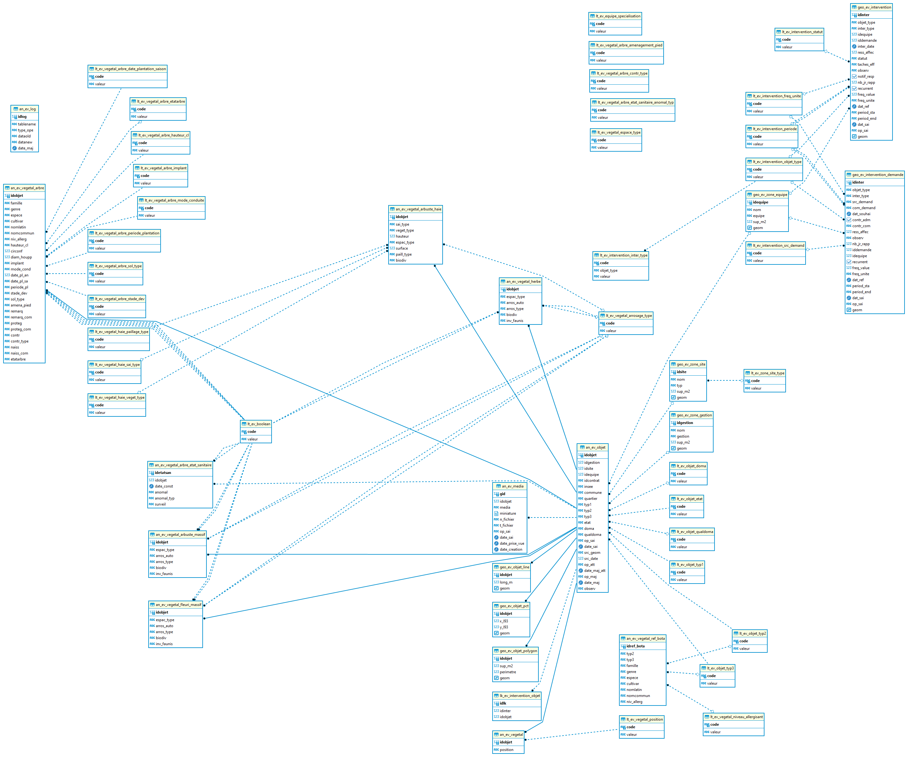

# Documentation d'administration de la base de données des espaces verts #

## Généralité
 
La démarche s'organise en 3 temps :
* inventorier cartographiquement
* spécifier les objets d'un point de vue métier
* exploiter et gérer les données de façon autonome par le(s) service(s) concerné(s) (tableau de bord, gestion et intervention).

## Principe de la modélisation des classes d'objets

## Modèle relationnel simplifié

## Schéma fonctionnel

(à venir)

## Dépendances

La base de données des espaces verts s'appuie sur des référentiels préexistants constituant autant de dépendances nécessaires pour l'implémentation de la base PEI.

|schéma | table | description | usage |
|:---|:---|:---|:---|   
|r_objet|lt_src_geom|domaine de valeur générique d'une table géographique|source du référentiel de saisies des objets|
|r_objet|lt_contrat|domaine de valeur générique d'une table géographique|identification des contrats extérieurs|

---

## Classes d'objets

L'ensemble des classes d'objets unitaires sont stockées dans le schéma m_espace_vert, celles dérivées et applicatives dans le schéma `x_apps`, celles dérivées pour les exports opendata dans le schéma `x_opendata`.

### Classe d'objet patrimoniale

`an_ev_objet` : table alphanumérique des métadonnées des objets des espaces verts (superclasse objet).

|Nom attribut | Définition | Type  | Valeurs par défaut |
|:---|:---|:---|:---|  
|idobjet|Identifiant unique de l'objet espace vert|bigint|nextval('m_espace_vert.an_ev_objet_idobjet_seq'::regclass)|
|idgestion|identifiant de la zone de gestion|integer| |
|idsite|Identifiant du site cohérent|integer| |
|idequipe|Identifiant de la zone d'équipe|integer| |
|idcontrat|Identifiant du contrat|character varying(2)| |
|insee|Code insee de la commune d'appartenance|character varying(5)| |
|commune|Libellé de la commune d'appartenance|character varying(80)| |
|quartier|Libellé du quartier|character varying(80)| |
|typ1|Type d'espace vert de niveau 1|character varying(1)| |
|typ2|Sous-Type d'espace vert de niveau 2|character varying(2)| |
|typ3|Sous-Type d'espace vert de niveau 3|character varying(3)| |
|etat|Etat de l'objet dans la base de données (projet, existant, supprimé)|character varying(1)|'0'::character varying|
|doma|Domanialité|character varying(2)| |
|qualdoma|Qualité de l'information liée à la domanialité|character varying(2)| |
|op_sai|Opérateur de saisie de l'objet|character varying(80)| |
|date_sai|Date de saisie de l'objet|timestamp without time zone| |
|src_geom|Référentiel géographique utilisé pour la saisie de l'objet|character varying(2)| |
|src_date|Date du référentiel géographique utilisé pour la saisie de l'objet|integer| |
|op_att|Opérateur de saisie des attributs métiers de l'objet initial|character varying(80)| |
|date_maj_att|Année de mise à jour des attributs métiers de l'objet initial|timestamp without time zone| |
|op_maj|Opérateur de la dernière mise à jour de l'objet|character varying(80)| |
|date_maj|Date de la dernière mise jour de l'objet|timestamp without time zone| |
|observ|Observations diverses|character varying(254)| |

Particularité(s) à noter :
* Une clé primaire existe sur le champ `idobjet` l'attribution automatique de la référence unique s'effectue via une vue de gestion. 
* Une clé étrangère existe sur la table de valeur `idequipe` (lien vers la table des équipes `geo_ev_zone_equipe`)
* Une clé étrangère existe sur la table de valeur `idgestion` (lien vers la table des zones de gestion `geo_ev_zone_gestion`)
* Une clé étrangère existe sur la table de valeur `idsite` (lien vers la table des sites cohérent `geo_ev_zone_site`)
* Une clé étrangère existe sur la table de valeur `doma` (lien vers une liste de valeurs `lt_ev_objet_doma`)
* Une clé étrangère existe sur la table de valeur `etat` (lien vers une liste de valeurs `lt_ev_objet_etat`)
* Une clé étrangère existe sur la table de valeur `qualdoma` (lien vers une liste de valeurs `lt_ev_objet_qualdoma`)
* Une clé étrangère existe sur la table de valeur `typ1` (lien vers la table des sites cohérent `lt_ev_objet_typ1`)
* Une clé étrangère existe sur la table de valeur `typ2` (lien vers une liste de valeurs `lt_ev_objet_typ2`)
* Une clé étrangère existe sur la table de valeur `typ3` (lien vers une liste de valeurs `lt_ev_objet_typ3`)
* Une clé étrangère existe sur la table de valeur `src_geom` (lien vers une liste de valeurs `lt_src_geom`)

 
`an_ev_objet_line_largeur` : classe d'attributs complémentaires des objets linéaires nécessitant une information de largeur

|Nom attribut | Définition | Type  | Valeurs par défaut |
|:---|:---|:---|:---|
|idobjet|Identifiant unique de les objets concernés|bigint| |
|larg_cm|Largeur des objets en cm|integer| |

Particularité(s) à noter : aucune

`an_ev_vegetal` : classe d'attributs complémentaires des objets "espace vert" de type végétal

|Nom attribut | Définition | Type  | Valeurs par défaut |
|:---|:---|:---|:---|
|idobjet|Identifiant unique de les objets concernés|bigint| |
|position|Position des objets|character varying(2)|'10'::character varying|

Particularité(s) à noter : 
* Une clé primaire existe sur le champ `idobjet` l'attribution automatique de la référence unique s'effectue via une vue de gestion. 
* Une clé étrangère existe sur la table de valeur `idobjet` (lien vers la table superclasse `an_ev_objet`)
* Une clé étrangère existe sur la table de valeur `position` (lien vers une liste de valeurs `lt_ev_vegetal_position`)

`an_ev_vegetal_arbre` : table alphanumérique du patrimoine végétal des objets Arbres.

|Nom attribut | Définition | Type  | Valeurs par défaut |
|:---|:---|:---|:---|  
|idobjet|Identifiant de l'objet|bigint| |
|famille|Nom de la famille de l'arbre (en latin)|character varying(20)| |
|genre|Nom du genre de l'arbre (en latin)|character varying(20)| |
|espece|Nom de l'espèce de l'arbre (en latin)|character varying(20)| |
|cultivar|Nom du cultivar de l'arbre (en latin)|character varying(20)| |
|nomlatin|Libellé scientifique complet du nom de l'arbre (en latin)|character varying(80)| |
|nomcommun|Libellé du nom commun/vernaculaire de l'arbre (en français)|character varying(80)| |
|niv_allerg|Niveau allergisant|character varying(2)|'00'::character varying|
|hauteur_cl|Classe de hauteur de l'arbre en mètre|character varying(2)|'00'::character varying|
|circonf|Circonférence du tronc en centimètre|integer| |
|diam_houpp|Diamètre houppier en mètre|integer| |
|implant|Type d'implantation de l'arbre|character varying(2)|'00'::character varying|
|mode_cond|Mode de conduite, assimilé à « port de taille » ou forme taillée|character varying(2)|'00'::character varying|
|date_pl_an|Date de plantation (année)|integer| |
|date_pl_sa|Date de plantation (saison)|character varying(2)|'00'::character varying|
|periode_pl|Période de plantation approx. (Décennie)|character varying(2)|'00'::character varying|
|stade_dev|Stade de développement|character varying(2)|'00'::character varying|
|sol_type|Type de sol|character varying(2)|'00'::character varying|
|amena_pied|Aménagement pied de l'arbre|character varying(80)| |
|remarq|Arbre remarquable (O/N)|character varying(1)|'0'::character varying|
|remarq_com|Commentaires arbre remarquable|character varying(254)| |
|proteg|Arbre protégé (O/N)|character varying(1)|'0'::character varying|
|proteg_com|Commentaires arbre protégé|character varying(254)| |
|contr|Contrainte (O/N)|character varying(1)|'0'::character varying|
|contr_type|Type(s) de contrainte(s)|character varying(80)| |
|naiss|Programme naissance (O/N)|character varying(1)|'0'::character varying|
|naiss_com|Commentaire arbre du programme naissance|character varying(254)| |
|etatarbre|Etat de l'arbre|character varying(2)| |

Particularité(s) à noter :
* Une clé primaire existe sur le champ `idobjet` l'attribution automatique de la référence unique s'effectue via une vue de gestion. 
* Une clé étrangère existe sur la table de valeur `idobjet` (lien vers la table superclasse `an_ev_objet`)
* Une clé étrangère existe sur la table de valeur `contr` (lien vers une liste de valeurs n `lt_ev_boolean`)
* Une clé étrangère existe sur la table de valeur `date_pl_sa` (lien vers une liste de valeurs `lt_ev_vegetal_arbre_date_plantation_saison`)
* Une clé étrangère existe sur la table de valeur `etatarbre` (lien vers une liste de valeurs `lt_ev_vegetal_arbre_etatarbre`)
* Une clé étrangère existe sur la table de valeur `hauteur_cl` (lien vers une liste de valeurs `lt_ev_vegetal_arbre_hauteur_cl`)
* Une clé étrangère existe sur la table de valeur `implant` (lien vers une liste de valeurs `lt_ev_vegetal_arbre_implant`)
* Une clé étrangère existe sur la table de valeur `mode_cond` (lien vers une liste de valeurs  `lt_ev_vegetal_arbre_mode_conduite`)
* Une clé étrangère existe sur la table de valeur `naiss` (lien vers une liste de valeurs `lt_ev_boolean`)
* Une clé étrangère existe sur la table de valeur `periode_pl` (lien vers une liste de valeurs `lt_ev_vegetal_arbre_periode_plantation`)
* Une clé étrangère existe sur la table de valeur `proteg` (lien vers une liste de valeurs `lt_ev_boolean`)
* Une clé étrangère existe sur la table de valeur `remarq` (lien vers une liste de valeurs `lt_ev_boolean`)
* Une clé étrangère existe sur la table de valeur `sol_type` (lien vers une liste de valeurs `lt_ev_vegetal_arbre_sol_type`)
* Une clé étrangère existe sur la table de valeur `stade_dev` (lien vers une liste de valeurs `lt_ev_vegetal_arbre_stade_dev`)

`an_ev_vegetal_arbre_etat_sanitaire` : classe d'attributs complémentaires sur les états sanitaires des arbres

|Nom attribut | Définition | Type  | Valeurs par défaut |
|:---|:---|:---|:---|  
|idetatsan|Identifiant de l'état|integer|nextval('m_espace_vert.an_ev_vegetal_arbre_etat_sanitaire_idetatsan_seq'::regclass)|
|idobjet|Identifiant de l'arbre|bigint| |
|date_const|Date du constat de l'état sanitaire de l'arbre|timestamp without time zone| |
|anomal|Arbre présentant des anomalies (O/N)|character varying(1)|'0'::character varying|
|anomal_typ|Type(s) d'anomalie(s) relevées|character varying(80)|'00'::character varying|
|surveil|Arbre à surveiller (O/N)|character varying(1)|'0'::character varying|

Particularité(s) à noter :
* Une clé primaire existe sur le champ `idetatsan` l'attribution automatique de la référence unique s'effectue via une vue de gestion. 
* Une clé étrangère existe sur la table de valeur `idobjet` (lien vers la table superclasse `an_ev_objet`)
* Une clé étrangère existe sur la table de valeur `anomal` (lien vers une liste de valeurs `lt_ev_boolean`)
* Une clé étrangère existe sur la table de valeur `surveil` (lien vers une liste de valeurs `lt_ev_boolean`)

`an_ev_vegetal_arbuste_haie` : classe d'attributs complémentaires des objets linéaires de type "Végétal" haie

|Nom attribut | Définition | Type  | Valeurs par défaut |
|:---|:---|:---|:---|
|idobjet|Identifiant unique de l'objet|bigint| |
|sai_type|Type de saisie de l'objet linéaire haie|character varying(2)| |
|veget_type|Type végétation|character varying(2)| |
|hauteur|Hauteur|numeric| |
|espac_type|Type d'espace|character varying(2)| |
|surface|Surface en mètre carré|numeric| |
|paill_type|Type de paillage|character varying(2)| |
|biodiv|Biodiversité|character varying(254)| |

Particularité(s) à noter :
* Une clé primaire existe sur le champ `idobjet` l'attribution automatique de la référence unique s'effectue via une vue de gestion. 
* Une clé étrangère existe sur la table de valeur `idobjet` (lien vers la table superclasse `an_ev_objet`)
* Une clé étrangère existe sur la table de valeur `espac_type` (llien vers une liste de valeurs `lt_ev_vegetal_arrosage_type`)
* Une clé étrangère existe sur la table de valeur `paill_type` (lien vers une liste de valeurs `lt_ev_vegetal_haie_paillage_type`)
* Une clé étrangère existe sur la table de valeur `sai_type` (lien vers une liste de valeurs `lt_ev_vegetal_haie_sai_type`)
* Une clé étrangère existe sur la table de valeur `veget_type` (lien vers une liste de valeurs `lt_ev_vegetal_haie_veget_type`)

`an_ev_vegetal_arbuste_massif` : classe d'attributs complémentaires des objets polygones de type "Végétal" massif arbustif

|Nom attribut | Définition | Type  | Valeurs par défaut |
|:---|:---|:---|:---|
|idobjet|Identifiant unique de l'objet|bigint| |
|espac_type|Type d'espace|character varying(2)|'00'::character varying|
|arros_auto|Arrosage automatique (O/N)|character varying(1)|'0'::character varying|
|arros_type|Type d'arrosage automatique|character varying(2)|'00'::character varying|
|biodiv|Biodiversité|character varying(254)| |
|inv_faunis|Inventaire faunistique / floristique réalisé (O/N)|character varying(1)|'0'::character varying|

Particularité(s) à noter :
* Une clé primaire existe sur le champ `idobjet` l'attribution automatique de la référence unique s'effectue via une vue de gestion. 
* Une clé étrangère existe sur la table de valeur `idobjet` (lien vers la table superclasse `an_ev_objet`)
* Une clé étrangère existe sur la table de valeur `arros_auto` (lien vers une liste de valeurs `lt_ev_boolean`)
* Une clé étrangère existe sur la table de valeur `arros_type` (lien vers une liste de valeurs `lt_ev_vegetal_arrosage_type`)
* Une clé étrangère existe sur la table de valeur `espac_type` (lien vers une liste de valeurs `lt_ev_vegetal_arrosage_type`)

`an_ev_vegetal_fleuri_massif` : classe d'attributs complémentaires des objets polygones de type "Végétal" massif fleuri

|Nom attribut | Définition | Type  | Valeurs par défaut |
|:---|:---|:---|:---|
|idobjet|Identifiant unique de l'objet|bigint| |
|espac_type|Type d'espace|character varying(2)|'00'::character varying|
|arros_auto|Arrosage automatique (O/N)|character varying(1)|'0'::character varying|
|arros_type|Type d'arrosage automatique|character varying(2)|'00'::character varying|
|biodiv|Biodiversité|character varying(254)| |
|inv_faunis|Inventaire faunistique / floristique réalisé (O/N)|character varying(1)|'0'::character varying|

Particularité(s) à noter :
* Une clé primaire existe sur le champ `idobjet` l'attribution automatique de la référence unique s'effectue via une vue de gestion. 
* Une clé étrangère existe sur la table de valeur `idobjet` (lien vers la table superclasse `an_ev_objet`)
* Une clé étrangère existe sur la table de valeur `arros_auto` (lien vers une liste de valeurs `lt_ev_boolean`)
* Une clé étrangère existe sur la table de valeur `inv_faunis` (lien vers une liste de valeurs `lt_ev_boolean`)
* Une clé étrangère existe sur la table de valeur `arros_type` (lien vers une liste de valeurs `lt_ev_vegetal_arrosage_type`)
* Une clé étrangère existe sur la table de valeur `espac_type` (lien vers une liste de valeurs `lt_ev_vegetal_arrosage_type`)

`an_ev_vegetal_herbe` : classe d'attributs complémentaires des objets polygones de type "Végétal" enherbé

|Nom attribut | Définition | Type  | Valeurs par défaut |
|:---|:---|:---|:---|
|idobjet|Identifiant unique de l'objet|bigint| |
|espac_type|Type d'espace|character varying(2)|'00'::character varying|
|arros_auto|Arrosage automatique (O/N)|character varying(1)|'0'::character varying|
|arros_type|Type d'arrosage automatique|character varying(2)|'00'::character varying|
|biodiv|Biodiversité|character varying(254)| |
|inv_faunis|Inventaire faunistique / floristique réalisé (O/N)|character varying(1)|'0'::character varying|

Particularité(s) à noter :
* Une clé primaire existe sur le champ `idobjet` l'attribution automatique de la référence unique s'effectue via une vue de gestion. 
* Une clé étrangère existe sur la table de valeur `idobjet` (lien vers la table superclasse `an_ev_objet`)
* Une clé étrangère existe sur la table de valeur `arros_auto` (lien vers une liste de valeurs `lt_ev_boolean`)
* Une clé étrangère existe sur la table de valeur `inv_faunis` (lien vers une liste de valeurs `lt_ev_boolean`)
* Une clé étrangère existe sur la table de valeur `arros_type` (lien vers une liste de valeurs `lt_ev_vegetal_arrosage_type`)
* Une clé étrangère existe sur la table de valeur `espac_type` (lien vers une liste de valeurs `lt_ev_vegetal_arrosage_type`)

`an_ev_vegetal_ref_bota` : table alphanumérique du référentiel botanique

|Nom attribut | Définition | Type  | Valeurs par défaut |
|:---|:---|:---|:---|
|idref_bota|Identifiant de la référence botanique|bigint|nextval('m_espace_vert.an_ev_vegetal_ref_bota_idref_bota_seq'::regclass)|
|typ2|Sous-Type d'espace vert de niveau 2|character varying(2)| |
|typ3|Sous-Type d'espace vert de niveau 3|character varying(3)| |
|famille|Nom de la famille(en latin)|character varying(20)| |
|genre|Nom du genre(en latin)|character varying(20)| |
|espece|Nom de l'espèce (en latin)|character varying(20)| |
|cultivar|Nom du cultivar (en latin)|character varying(80)| |
|nomlatin|Libellé scientifique complet (en latin)|character varying(80)| |
|nomcommun|Libellé du nom commun/vernaculaire (en français)|character varying(80)| |
|niv_allerg|Niveau allergisant|character varying(2)| |

Particularité(s) à noter :
* Une clé primaire existe sur le champ `idref_bota`
* Une clé étrangère existe sur la table de valeur `typ2` (lien vers la table superclasse `lt_ev_objet_typ2`)
* Une clé étrangère existe sur la table de valeur `typ3` (lien vers une liste de valeurs `lt_ev_objet_typ3`)
* Une clé étrangère existe sur la table de valeur `niv_allerg` (lien vers une liste de valeurs `lt_ev_vegetal_niveau_allergisant`)

`geo_ev_intervention` : table alphanumérique de gestion des interventions

|Nom attribut | Définition | Type  | Valeurs par défaut |
|:---|:---|:---|:---|
|objet_type|Type d'objets|character varying(3)| |
|inter_type|Type d'intervention|character varying(254)|'00000'::character varying|
|iddemande|Demande liée|integer| |
|inter_date|Date d'intervention|date|now()|
|ress_affec|Équipe / Entreprise|integer| |
|statut|Statut|character varying(2)|'00'::character varying|
|taches_eff|Liste des tâches effectuées|text| |
|observ|Observations|character varying(254)| |
|notif_resp|Envoyer notification aux responsables EV ?|boolean|true|
|nb_jr_rapp|Nb jours rappel|integer| |
|recurrent|Intervention récurrente|boolean|false|
|freq_value|Fréquence (valeur)|integer| |
|freq_unite|Fréquence (unité)|character varying(2)|'00'::character varying|
|dat_ref|Date de référence|date| |
|dat_sai|Date saisie|timestamp without time zone|now()|
|op_sai|Auteur saisie|character varying(80)| |

Particularité(s) à noter :
* Une clé primaire existe sur le champ `idinter`
* Une clé étrangère existe sur la table de valeur `freq_unite` (lien vers la table superclasse `lt_ev_intervention_freq_unite`)
* Une clé étrangère existe sur la table de valeur `objet_type` (lien vers une liste de valeurs `lt_ev_intervention_objet_type`)
* Une clé étrangère existe sur la table de valeur `period_end` (lien vers une liste de valeurs `lt_ev_intervention_periode`)
* Une clé étrangère existe sur la table de valeur `period_sta` (lien vers une liste de valeurs `lt_ev_intervention_periode`)
* Une clé étrangère existe sur la table de valeur `ress_affec` (lien vers la table géographique `geo_ev_zone_equipe`)
* Une clé étrangère existe sur la table de valeur `statut` (lien vers une liste de valeurs `lt_ev_intervention_statut`)

`geo_ev_intervention_demande` : table alphanumérique de gestion des demandes d'interventions

|Nom attribut | Définition | Type  | Valeurs par défaut |
|:---|:---|:---|:---|
|objet_type|Type d'objets|character varying(3)| |
|inter_type|Type d'intervention|character varying(254)|'00000'::character varying|
|src_demand|Source demande|character varying(2)|'00'::character varying|
|com_demand|Commentaire demande|text| |
|dat_souhai|Date d'intervention souhaitée|date| |
|contr_adm|Contraintes administratives|boolean|false|
|contr_com|Commentaire sur contraintes adm.|text| |
|ress_affec|Équipe / Entreprise affectée|integer| |
|observ|Observations|character varying(254)| |
|nb_jr_rapp|Nb jours rappel|integer| |
|recurrent|Demande d'intervention récurrente|boolean|false|
|freq_value|Fréquence (valeur)|integer| |
|freq_unite|Fréquence (unité)|character varying(2)|'00'::character varying|
|dat_ref|Date de référence|date| |
|dat_sai|Date saisie|timestamp without time zone|now()|
|op_sai|Auteur saisie|character varying(80)| |

Particularité(s) à noter :
* Une clé primaire existe sur le champ `idinter`
* Une clé étrangère existe sur la table de valeur `freq_unite` (lien vers la table superclasse `lt_ev_intervention_freq_unite`)
* Une clé étrangère existe sur la table de valeur `objet_type` (lien vers une liste de valeurs `lt_ev_intervention_objet_type`)
* Une clé étrangère existe sur la table de valeur `period_end` (lien vers une liste de valeurs `lt_ev_intervention_periode`)
* Une clé étrangère existe sur la table de valeur `period_sta` (lien vers une liste de valeurs `lt_ev_intervention_periode`)
* Une clé étrangère existe sur la table de valeur `ress_affec` (lien vers la table géographique `geo_ev_zone_equipe`)
* Une clé étrangère existe sur la table de valeur `statut` (lien vers une liste de valeurs `lt_ev_intervention_statut`)

`geo_ev_objet_line` : table géographique des objets des espaces verts saisis sous forme de polyligne

|Nom attribut | Définition | Type  | Valeurs par défaut |
|:---|:---|:---|:---|
|idobjet|Identifiant des objets espaces verts|bigint| |
|long_m|Longueur en mètres|integer| |
|geom|Géométrie des objets espace vert|USER-DEFINED| |

Particularité(s) à noter :
* Une clé primaire existe sur le champ `idobjet` l'attribution automatique de la référence unique s'effectue via une vue de gestion. 
* Une clé étrangère existe sur la table de valeur `idobjet` (lien vers la table superclasse `an_ev_objet`)

`geo_ev_objet_pct` : table géographique des objets des espaces verts saisis sous forme de ponctuel

|Nom attribut | Définition | Type  | Valeurs par défaut |
|:---|:---|:---|:---|  
|idobjet|Identifiant des objets espaces verts|bigint| |
|x_l93|Coordonnées X en lambert 93|numeric| |
|y_l93|Coordonnées Y en Lambert 93|numeric| |
|geom|Géométrie des objets espaces verts|USER-DEFINED| |

Particularité(s) à noter :
* Une clé primaire existe sur le champ `idobjet` l'attribution automatique de la référence unique s'effectue via une vue de gestion. 
* Une clé étrangère existe sur la table de valeur `idobjet` (lien vers la table superclasse `an_ev_objet`)

`geo_ev_objet_polygon` : table géographique des objets des espaces verts saisis sous forme de polygone

|Nom attribut | Définition | Type  | Valeurs par défaut |
|:---|:---|:---|:---|
|idobjet|Identifiant des objets espaces verts|bigint| |
|sup_m2|Surface en mètre carré|integer| |
|perimetre|Périmètre des objets surfaciques en mètre|integer| |
|geom|Géométrie des objets espace vert|USER-DEFINED| |

Particularité(s) à noter :
* Une clé primaire existe sur le champ `idobjet` l'attribution automatique de la référence unique s'effectue via une vue de gestion. 
* Une clé étrangère existe sur la table de valeur `idobjet` (lien vers la table superclasse `an_ev_objet`)

### Classe d'objet non patrimoniale

`an_ev_media` : Table gérant la liste des photos des objets Espace Vert (arbre notamment) avec le module média dans GEO (application Espace Vert)

|Nom attribut | Définition | Type  | Valeurs par défaut |
|:---|:---|:---|:---|  
|gid|Identifiant unique du média|bigint|nextval('m_espace_vert.an_ev_media_gid_seq'::regclass)|
|idobjet|Identifiant de l'objet|bigint| |
|media|Champ Média de GEO|text| |
|miniature|Champ miniature de GEO|bytea| |
|n_fichier|Nom du fichier|text| |
|t_fichier|Type de média dans GEO|text| |
|op_sai|Libellé de l'opérateur ayant intégrer le document|character varying(100)| |
|date_sai|Date d'intégration du document|timestamp without time zone| |

Particularité(s) à noter :
* Une clé primaire existe sur le champ `idobjet` l'attribution automatique de la référence unique s'effectue via une vue de gestion. 
* Une clé étrangère existe sur la table de valeur `idobjet` (lien vers la table superclasse `an_ev_objet`)

`geo_ev_zone_equipe` : table géographique délimitant les zones d'équipe du service espace vert

|Nom attribut | Définition | Type  | Valeurs par défaut |
|:---|:---|:---|:---|
|idequipe|Identifiant d'équipe|bigint|nextval('m_espace_vert.geo_ev_zone_equipe_idequipe_seq'::regclass)|
|nom|Nom de la zone de equipe|character varying(100)| |
|equipe|Nom du equipenaire|character varying(80)| |
|sup_m2|Surface en mètre carré|bigint| |
|geom|Géométrie surfacique|USER-DEFINED| |

Particularité(s) à noter :
* Une clé primaire existe sur le champ `idequipe` 

`geo_ev_zone_gestion` : table géographique délimitant les zones de gestion/entretien interne du service espace vert

|Nom attribut | Définition | Type  | Valeurs par défaut |
|:---|:---|:---|:---|
|idgestion|Identifiant du site|bigint|nextval('m_espace_vert.geo_ev_zone_gestion_idgestion_seq'::regclass)|
|nom|Nom de la zone de gestion|character varying(100)| |
|gestion|Nom du gestionnaire|character varying(80)| |
|sup_m2|Surface en mètre carré|bigint| |
|geom|Géométrie surfacique|USER-DEFINED| |

Particularité(s) à noter :
* Une clé primaire existe sur le champ `idgestion` 

`geo_ev_zone_site` : table géographique délimitant les sites cohérents

|Nom attribut | Définition | Type  | Valeurs par défaut |
|:---|:---|:---|:---|
|idsite|Identifiant du site|bigint|nextval('m_espace_vert.geo_ev_zone_site_idsite_seq'::regclass)|
|nom|Nom du site|character varying(100)| |
|typ|Type de site|character varying(2)| |
|sup_m2|Surface en mètre carré|bigint| |
|geom|Géométrie surfacique|USER-DEFINED| |

Particularité(s) à noter :
* Une clé primaire existe sur le champ `idsite` 
* Une clé étrangère existe sur la table de valeur `typ` (lien vers une liste de valeurs `lt_ev_zone_site_type`)

`geo_ev_secteur_gestion_arc` : table géographique délimitant les zones de gestion de l'ARC

|Nom attribut | Définition | Type  | Valeurs par défaut |
|:---|:---|:---|:---|  
|idsecteur|Identifiant du secteur|bigint|nextval('m_espace_vert.geo_ev_secteur_gestion_arc_seq'::regclass)|
|nom_secteur|Nom du secteur de gestion de l'ARC|character varying(100)| |
|coherence|Cohérence (oui/non) entre le zonage terrain et le zonage d'intervention réel|character varying(80)| |
|remarques|Champ texte pour les remarques|character varying(250)| |
|sup_m2|Surface en mètre carré|bigint| |
|insee|Code INSEE|character varying(5)| |
|commune|Nom de la commune|character varying(250)| |
|op_sai|Opérateur de saisie de l'objet|character varying(80)| |
|date_sai|Date de saisie de l'objet|timestamp without time zone| |
|op_maj|Opérateur de la dernière mise à jour de l'objet|character varying(80)| |
|date_maj|Date de la dernière mise jour de l'objet|timestamp without time zone| |
|geom|Géométrie surfacique|USER-DEFINED| |

Particularité(s) à noter :
* Une clé primaire existe sur le champ `idsecteur` 

## Liste de valeurs

`lt_ev_boolean` : Liste d'attribut de type booléen

|Nom attribut | Définition | Type  | Valeurs par défaut |
|:---|:---|:---|:---|    
|code|Code de la liste énumérée relative à l'état d'un attribut boolean|character varying(1)| |
|valeur|Valeur de la liste énumérée relative à l'état d'un attribut boolean|character varying(30)| |

Valeurs possibles :

|code | valeur |
|:---|:---| 
|0|Non renseigné|
|f|Non|
|t|Oui|
|z|Non concerné|

`lt_ev_equipe_specialisation` : Liste permettant de décrire les specialisations des équipes

|Nom attribut | Définition | Type  | Valeurs par défaut |
|:---|:---|:---|:---|    
|code|Code de la classe décrivant la liste des spécialisations des entreprises|character varying(2)| |
|valeur|Valeur de la classe décrivant la liste des spécialisations des entreprises|character varying(80)| |

Valeurs possibles :

|code | valeur |
|:---|:---| 
|00|Non renseigné|
|01|Taille en rideau|
|02|Tonte|
|03|Désherbage|
|04|Taille|

`lt_ev_intervention_freq_unite` : Liste permettant de décrire les fréquences des demandes d'intervention

|Nom attribut | Définition | Type  | Valeurs par défaut |
|:---|:---|:---|:---|    
|code|Code de la classe décrivant les unités pour la fréquence des demandes d'intervention|character varying(2)| |
|valeur|Valeur de la classe décrivant les unités pour la fréquence des demandes d'intervention|character varying(80)| |

Valeurs possibles :

|code | valeur |
|:---|:---| 
|01|Jours|
|02|Semaines|
|03|Mois|
|04|Ans|
|00|Non renseigné|

`lt_ev_intervention_inter_type` : Liste permettant de décrire les types d'interventions

|Nom attribut | Définition | Type  | Valeurs par défaut |
|:---|:---|:---|:---|    
|code|Code de la classe décrivant le type d'intervention|character varying(5)| |
|valeur|Valeur de la classe décrivant le type d'intervention|character varying(80)| |

Valeurs possibles :

|code | valeur |
|:---|:---| 
|00000|Non renseigné|
|11100|Non renseigné|
|11101|Abattage|
|11102|Dessouchage|
|11103|Tête de chat|
|11104|Cohabitation|
|11105|Sanitaire|
|11106|Sélection|
|11107|Démontage|
|11108|Remontée de couronne|
|11109|Formation|
|11110|Branche cassée|
|11111|Branche en suspension|
|11112|Arbre accidenté|
|11301|Abattage|
|11302|Coupe|
|11303|Elagage|
|12201|Abattage|
|12202|Coupe|
|12203|Elagage|
|12301|Tonte|
|12302|Traitement|
|13201|Tonte|
|13202|Traitement|
|14101|Tonte|
|14102|Traitement|

`lt_ev_intervention_objet_type` : Liste permettant de décrire le type d'objet des interventions

|Nom attribut | Définition | Type  | Valeurs par défaut |
|:---|:---|:---|:---|    
|code|Code de la classe décrivant le Type d'objet des interventions|character varying(3)| |
|valeur|Valeur de la classe décrivant le Type d'objet des interventions|character varying(80)| |

Valeurs possibles :

|code | valeur |
|:---|:---| 
|000|Non renseigné|
|111|Arbres|
|113|Zones boisées|
|122|Haies|
|123|Massifs arbustifs|
|132|Massifs fleuris|
|141|Engazonnements|

`lt_ev_intervention_periode` : Liste permettant de décrire les mois de l'année des interventions

|Nom attribut | Définition | Type  | Valeurs par défaut |
|:---|:---|:---|:---|    
|code|Code de la classe décrivant les mois de l'année|character varying(2)| |
|valeur|Valeur de la classe décrivant les mois de l'année|character varying(80)| |

Valeurs possibles :

|code | valeur |
|:---|:---| 
|01|Janvier|
|02|Février|
|03|Mars|
|04|Avril|
|05|Mai|
|06|Juin|
|07|Juillet|
|08|Août|
|09|Septembre|
|10|Octobre|
|11|Novembre|
|12|Décembre|
|00|Non renseigné|

`lt_ev_intervention_src_demand` : Liste permettant de décrire la source d'une demande d'intervention

|Nom attribut | Définition | Type  | Valeurs par défaut |
|:---|:---|:---|:---|    
|code|Code de la classe décrivant la source d'une demande d'intervention|character varying(2)| |
|valeur|Valeur de la classe décrivant la source d'une demande d'intervention|character varying(80)| |

Valeurs possibles :

|code | valeur |
|:---|:---| 
|00|Non renseigné|
|01|Interne|
|02|Riverain|

`lt_ev_intervention_statut` : Liste permettant de décrire le statut des demandes d'intervention

|Nom attribut | Définition | Type  | Valeurs par défaut |
|:---|:---|:---|:---|    
|code|Code de la classe décrivant les unités pour le statut des demandes d'intervention|character varying(2)| |
|valeur|Valeur de la classe décrivant les unités pour le statut des demandes d'intervention|character varying(80)| |

Valeurs possibles :

|code | valeur |
|:---|:---| 
|00|Non renseigné|
|01|Terminée|
|02|Annulée|
|03|Suspendue|
|04|En cours|

`lt_ev_objet_doma` : Liste permettant de décrire les types domanialités

|Nom attribut | Définition | Type  | Valeurs par défaut |
|:---|:---|:---|:---|    
|code|code du type de domanialité|character varying(2)| |
|valeur|valeur du type de domanialité|character varying(50)| |

Valeurs possibles :

|code | valeur |
|:---|:---|  
|00|Non renseignée|
|10|Publique|
|20|Privée (non déterminé)|
|21|Privée (communale)|
|22|Privée (autre organisme public, HLM, ...)|
|23|Privée|

`lt_ev_objet_etat` : Liste permettant de décrire l'état des objets EV

|Nom attribut | Définition | Type  | Valeurs par défaut |
|:---|:---|:---|:---|    
|code|Code de la liste énumérée relative à l'état des objets EV|character varying(1)| |
|valeur|Valeur de la liste énumérée relative à l'état des objets EV|character varying(80)| |

Valeurs possibles :

|code | valeur |
|:---|:---|  
|0|Non renseigné|
|1|Projet|
|2|Existant|
|3|Supprimé|

`lt_ev_qualdoma` : Liste permettant de décrire la qualité de l'information sur la domanialité

|Nom attribut | Définition | Type  | Valeurs par défaut |
|:---|:---|:---|:---|    
|code|Code de la qualité de l'information liée à la domanialité|character varying(2)| |
|valeur|valeur de la qualité de l'information liée à la domanialité|character varying(50)| |

Valeurs possibles :

|code | valeur |
|:---|:---|  
|00|Non renseignée|
|10|Déduite|
|20|Déclarative|

`lt_ev_objet_typ1` : Liste permettant de décrire la nomenclature de niveau 1 des objets d'espaces verts.

|Nom attribut | Définition | Type  | Valeurs par défaut |
|:---|:---|:---|:---|    
|code|Code du type principal des objets espaces verts|character varying(1)| |
|valeur|Valeur du type principal des objets espaces verts|character varying(50)| |

Valeurs possibles :

|code | valeur |
|:---|:---| 
|0|Non renseigné|
|1|Végétal|
|2|Minéral|
|3|Hydrographie|
|9|Référence non classée|

`lt_ev_objet_typ2` : Liste permettant de décrire la nomenclature de niveau 2 des objets d'espaces verts.

|Nom attribut | Définition | Type  | Valeurs par défaut |
|:---|:---|:---|:---|    
|code|Code du sous-type de niveau 2 principal des objets espaces verts|character varying(2)| |
|valeur|Valeur du sous-type de niveau 2 principal des objets espaces verts|character varying(100)| |

Valeurs possibles :

|code | valeur |
|:---|:---| 
|00|Non renseigné|
|11|Arboré|
|12|Arbustif|
|13|Fleuri|
|14|Enherbé|
|21|Circulation|
|22|Clôture|
|23|Loisirs|
|31|Arrivée d'eau|
|32|Espace en eau|
|99|Référence non classée|

`lt_ev_objet_typ3` : Liste permettant de décrire la nomenclature de niveau 3 des objets d'espaces verts.

|Nom attribut | Définition | Type  | Valeurs par défaut |
|:---|:---|:---|:---|    
|code|Code du sous-type de niveau 3 principal des objets espaces verts|character varying(3)| |
|valeur|Valeur du sous-type de niveau 3 principal des objets espaces verts|character varying(100)| |

Valeurs possibles :

|code | valeur |
|:---|:---| 
|000|Non renseigné|
|111|Arbre isolé|
|112|Arbre en alignement|
|113|Zone boisée|
|121|Arbuste isolé|
|122|Haie arbustive|
|123|Massif arbustif|
|131|Point fleuri|
|132|Massif fleuri|
|141|Pelouse, gazon|
|211|Allée|
|212|Piste cyclable|
|213|Parking matérialisé|
|214|Espace de stationnement libre|
|215|Parvis, place|
|219|Autre circulation|
|221|Mur|
|222|Grillage|
|223|Palissage|
|229|Autre clôture|
|231|Loisirs isolé|
|232|Surface de loisirs|
|311|Fontaine|
|312|Robinet|
|319|Autre arrivée d'eau|
|321|Rivière|
|322|Ru|
|323|Bassin|
|324|Marre|
|325|Etang|
|329|Autre espace en eau|
|999|Référence non classée|

`lt_ev_vegetal_arbre_amenagement_pied` : Liste permettant de décrire l'aménagement du pied des arbres.

|Nom attribut | Définition | Type  | Valeurs par défaut |
|:---|:---|:---|:---|    
|code|Code de la classe décrivant l'aménagement du pied des arbres|character varying(2)| |
|valeur|Valeur de la classe décrivant l'aménagement du pied des arbres|character varying(80)| |

Valeurs possibles :

|code | valeur |
|:---|:---| 
|00|Non renseigné|
|01|Grille|
|02|Fleuri|
|03|Paillage|
|99|Autre|

`lt_ev_vegetal_arbre_contr_type` : Liste permettant de décrire le type de contrainte des arbres.

|Nom attribut | Définition | Type  | Valeurs par défaut |
|:---|:---|:---|:---|    
|code|Code de la classe décrivant le Type de contrainte des arbres|character varying(2)| |
|valeur|Valeur de la classe décrivant le Type de contrainte des arbres|character varying(80)| |

Valeurs possibles :

|code | valeur |
|:---|:---| 
|00|Non renseigné|
|01|Cohabitation|
|02|Candélabre|
|03|Bâtiment|
|04|Feu de signalisation|
|05|Cable aérien|
|99|Autre|

`lt_ev_vegetal_arbre_date_plantation_saison` : Liste permettant de décrire la date de plantation (saison) des arbres.

|Nom attribut | Définition | Type  | Valeurs par défaut |
|:---|:---|:---|:---|    
|code|Code de la classe décrivant la Date de plantation (saison) des arbres|character varying(2)| |
|valeur|Valeur de la classe décrivant la Date de plantation (saison) des arbres|character varying(80)| |

Valeurs possibles :

|code | valeur |
|:---|:---| 
|00|Non renseigné|
|01|Hiver|
|02|Printemps|
|03|Eté|
|04|Automne|

`lt_ev_vegetal_arbre_etat_sanitaire_anomal_typ` : Liste permettant de décrire le type d'anomalie des arbres.

|Nom attribut | Définition | Type  | Valeurs par défaut |
|:---|:---|:---|:---|    
|code|Code de la classe décrivant le Type d'anomalie des arbres|character varying(2)| |
|valeur|Valeur de la classe décrivant le Type d'anomalie des arbres|character varying(80)| |

Valeurs possibles :

|code | valeur |
|:---|:---| 
|00|Non renseigné|
|01|Descente de cime|
|02|Champignon|
|03|Ravageur|
|04|Pourriture|
|05|Défaut mécanique (écorce incluse)|
|06|Racine altérée|
|99|Autre|

`lt_ev_vegetal_arbre_etatarbre` : Liste permettant de décrire l'état des arbres.

|Nom attribut | Définition | Type  | Valeurs par défaut |
|:---|:---|:---|:---|    
|code|Code de la classe décrivant l'état des arbres|character varying(2)| |
|valeur|Valeur de la classe décrivant l'état des arbres|character varying(80)| |

Valeurs possibles :

|code | valeur |
|:---|:---| 
|00|Non renseigné|
|10|Projet|
|20|Existant|
|21|Abattu|
|22|Désouché|
|30|Supprimé|

`lt_ev_vegetal_arbre_hauteur_cl` : Liste permettant de décrire la hauteur des arbres.

|Nom attribut | Définition | Type  | Valeurs par défaut |
|:---|:---|:---|:---|    
|code|Code de la classe décrivant la hauteur des objets ponctuels arbre|character varying(2)| |
|valeur|Valeur de la classe décrivant la hauteur des objets ponctuels arbre|character varying(80)| |

Valeurs possibles :

|code | valeur |
|:---|:---| 
|00|Non renseigné|
|01|Moins de 1 mètre|
|02|1 à 2 mètres|
|03|2 à 5 mètres|
|04|5 à 10 mètres|
|05|10 à 15 mètres|
|06|15 à 20 mètres|
|07|Plus de 20 mètres|

`lt_ev_vegetal_arbre_implant` : Liste permettant de décrire la classe d'implantation de chaque objet arbre

|Nom attribut | Définition | Type  | Valeurs par défaut |
|:---|:---|:---|:---|  
|code|Code de la classe décrivant l'implantation des objets ponctuels arbre|character varying(2)| |
|valeur|Valeur de la classe décrivant l'implantation des objets ponctuels arbre|character varying(80)| |

Valeurs possibles :

|code | valeur |
|:---|:---|
|00|Non renseigné|
|01|Isolé|
|02|Alignement|
|03|Bois|

`lt_ev_vegetal_arbre_mode_conduite` : Liste permettant de décrire le mode de conduite des arbres.

|Nom attribut | Définition | Type  | Valeurs par défaut |
|:---|:---|:---|:---|    
|code|Code de la classe décrivant le Mode de conduite des arbres|character varying(2)| |
|valeur|Valeur de la classe décrivant le Mode de conduite des arbres|character varying(80)| |

Valeurs possibles :

|code | valeur |
|:---|:---| 
|00|Non renseigné|
|01|Tête de chat|
|02|Mauvais suivi|
|03|Rideaux|
|04|Port libre|
|05|Semi libre|
|06|Accompagnement|
|99|Autre|

`lt_ev_vegetal_arbre_periode_plantation` : Liste permettant de décrire la période de plantation des arbres.

|Nom attribut | Définition | Type  | Valeurs par défaut |
|:---|:---|:---|:---|    
|code|Code de la classe décrivant la Période de plantation des arbres|character varying(2)| |
|valeur|Valeur de la classe décrivant la Période de plantation des arbres|character varying(80)| |

Valeurs possibles :

|code | valeur |
|:---|:---| 
|00|Non renseigné|
|01|avant 1900|
|02|1900 à 1909|
|03|1910 à 1919|
|04|1920 à 1929|
|05|1930 à 1939|
|06|1940 à 1949|
|07|1950 à 1959|
|08|1960 à 1969|
|09|1970 à 1979|
|10|1980 à 1989|
|11|1990 à 1999|
|12|2000 à 2009|
|13|2010 à 2019|
|14|2020 à 2029|

`lt_ev_vegetal_arbre_sol_type` : Liste permettant de décrire le type de sol des arbres.

|Nom attribut | Définition | Type  | Valeurs par défaut |
|:---|:---|:---|:---|    
|code|Code de la classe décrivant le Type de sol des arbres|character varying(2)| |
|valeur|Valeur de la classe décrivant le Type de sol des arbres|character varying(80)| |

Valeurs possibles :

|code | valeur |
|:---|:---| 
|00|Non renseigné|
|01|Mauvais|
|02|Moyen|
|03|Bon|

`lt_ev_vegetal_arbre_stade_dev` : Liste permettant de décrire le stade de développement des arbres.

|Nom attribut | Définition | Type  | Valeurs par défaut |
|:---|:---|:---|:---|    
|code|Code de la classe décrivant le Stade de développement des arbres|character varying(2)| |
|valeur|Valeur de la classe décrivant le Stade de développement des arbres|character varying(80)| |

Valeurs possibles :

|code | valeur |
|:---|:---| 
|00|Non renseigné|
|01|Jeune|
|02|Adulte|
|03|Mature|

`lt_ev_vegetal_arrosage_type` : Liste permettant de décrire le type d'arrosage automatique des espaces végétalisés.

|Nom attribut | Définition | Type  | Valeurs par défaut |
|:---|:---|:---|:---|    
|code|Code de la classe décrivant le Type d'arrosage automatique des espaces végétalisés|character varying(2)| |
|valeur|Valeur de la classe décrivant le Type d'arrosage automatique des espaces végétalisés|character varying(80)| |

Valeurs possibles :

|code | valeur |
|:---|:---| 
|00|Non renseigné|
|01|Arrosage à jet rotatif|
|02|Arrosage goutte à goutte ou localisé|
|03|Arrosage en surface - asperseur|
|04|Arrosage enterré|
|05|Tuyaux poreux|
|06|Arroseur oscillant|
|07|Arroseur canon|
|08|Tuyaux à goutteurs intégrés|

`lt_ev_vegetal_espace_type` : Liste permettant de décrire le type d'espace des espaces végétalisés.

|Nom attribut | Définition | Type  | Valeurs par défaut |
|:---|:---|:---|:---|    
|code|Code de la classe décrivant le Type d'espace des espaces végétalisés|character varying(2)| |
|valeur|Valeur de la classe décrivant le Type d'espace des espaces végétalisés|character varying(80)| |

Valeurs possibles :

|code | valeur |
|:---|:---| 
|00|Non renseigné|
|01|Ambiance fleuries/horticoles|
|02|Ambiance végétale/ornementales|
|03|Ambiance champêtre|
|04|Ambiance de nature|

`lt_ev_vegetal_haie_paillage_type` : Liste permettant de décrire le type paillage des haies.

|Nom attribut | Définition | Type  | Valeurs par défaut |
|:---|:---|:---|:---|    
|code|Code de la classe décrivant le Type paillage des haies|character varying(2)| |
|valeur|Valeur de la classe décrivant le Type paillage des haies|character varying(80)| |

Valeurs possibles :

|code | valeur |
|:---|:---| 
|00|Non renseigné|
|01|Paillage organique|
|02|Paillage minéral|

`lt_ev_zone_site_type` : Liste permettant de décrire les types principaux des sites

**Proposition de classement des sites de lévé cartographique d'après le classement établis par le standard GeoPal. Pourra être adapté en fonction des besoins du service espace vert**

|Nom attribut | Définition | Type  | Valeurs par défaut |
|:---|:---|:---|:---|    
|code|code du type de site intégrant les objets des espaces verts|character varying(2)| |
|valeur|libellé du type de site intégrant les objets des espaces verts|character varying(100)| |

Valeurs possibles :

|code | valeur |
|:---|:---|  
|00|Non renseigné|
|01|Parc, jardin, square|
|02|Accotements de voies|
|03|Accompagnement de bâtiments publics|
|04|Accompagnement d'habitations|
|05|Accompagnement d'établissements industriels et commerciaux|
|06|Enceinte sportive|
|07|Cimetière|
|11|Espace naturel aménagé|
|08|Enceinte scolaire|
|99|Référence non classée|

`lt_ev_vegetal_haie_sai_type` : Liste permettant de décrire le type de saisie de la sous-classe de précision des objets espace vert de type haie

|Nom attribut | Définition | Type  | Valeurs par défaut |
|:---|:---|:---|:---|  
|code|Code de la classe du type de saisie de la sous-classe de précision des objets espace vert de type haie|character varying(2)| |
|valeur|Valeur de la classe du type de saisie de la sous-classe de précision des objets espace vert de type haie|character varying(80)| |

Valeurs possibles :

|code | valeur |
|:---|:---|
|10|Largeur à appliquer au centre du linéaire|
|20|Largeur à appliquer dans le sens de saisie|
|30|Largeur à appliquer dans le sens inverse de saisie|

`lt_ev_vegetal_position` : Liste permettant de décrire le type de saisie de la sous-classe de précision des objets espace vert de type haie

|Nom attribut | Définition | Type  | Valeurs par défaut |
|:---|:---|:---|:---|  
|code|Code de la classe décrivant la position des objets espace vert de type végétal|character varying(2)| |
|valeur|Valeur de la classe décrivant la position des objets espace vert de type végétal|character varying(80)| |

Particularité(s) à noter : aucune

Valeurs possibles :

|code | valeur |
|:---|:---|
|00|Non renseigné|
|10|Sol|
|20|Hors-sol (non précisé)|
|21|Pot|
|22|Bac|
|23|Jardinière|
|24|Suspension|
|29|Hors-sol (autre)|

---

### classes d'objets applicatives de gestion :

`geo_v_ev_line` : vue de gestion permettant la saisie des objets "espace vert" de type ligne

* Fonction triggers : sans objet

`geo_v_ev_pct` : vue de gestion permettant la saisie des objets "espace vert" de type ponctuel (hors arbre)

* Fonction triggers : sans objet

`geo_v_ev_arbre` : vue de gestion permettant la saisie des objets "espace vert" der nature arbre

* Fonction triggers : sans objet

`geo_v_ev_polygon` : vue de gestion permettant la saisie des objets "espace vert" de type polygone. L'automatisation des valeurs liées aux géométries (surface et périmètre) sera intégrée après l'intégration de l'inventaire cartographique dans une optique de gestion interne des objets par le service métier.

* Fonction triggers : sans objet

---

### classes d'objets applicatives métiers sont classés dans le schéma x_apps :
 
**Ces vues sont stockées temporairement dans le schéma de procution `m_espace_vert_v2` et non dans le schéma `x_apps`.**

`geo_ev_vegetal_arbreisole` : vue de saisie du gabarit permettant la saisie des objets "espace vert" de type "végétal" et en niveau 3 de la nomenclature correspondant à "arbre isolé".

`geo_ev_vegetal_arbrealignement` : vue de saisie du gabarit permettant la saisie des objets "espace vert" de type "végétal" et en niveau 3 de la nomenclature correspondant à "alignement d'arbre".

`geo_ev_vegetal_zoneboisee` : vue de saisie du gabarit permettant la saisie des objets "espace vert" de type "végétal" et en niveau 3 de la nomenclature correspondant à "zone boisée".

`geo_ev_vegetal_arbusteisole` : vue de saisie du gabarit permettant la saisie des objets "espace vert" de type "végétal" et en niveau 3 de la nomenclature correspondant à "arbuste isolé".

`geo_ev_vegetal_haie` : vue de saisie du gabarit permettant la saisie des objets "espace vert" de type "végétal" et en niveau 3 de la nomenclature correspondant à "haie".

`geo_ev_vegetal_massifarbustif` : vue de saisie du gabarit permettant la saisie des objets "espace vert" de type "végétal" et en niveau 3 de la nomenclature correspondant à "massif arbustif".

`geo_ev_vegetal_pointfleuri` : : vue de saisie du gabarit permettant la saisie des objets "espace vert" de type "végétal" et en niveau 3 de la nomenclature correspondant à "fleuri isolé".

`geo_ev_vegetal_massiffleuri` : vue de saisie du gabarit permettant la saisie des objets "espace vert" de type "végétal" et en niveau 3 de la nomenclature correspondant à "massif fleuri".

`geo_ev_vegetal_espaceenherbe` : : vue de saisie du gabarit permettant la saisie des objets "espace vert" de type "végétal" et en niveau 3 de la nomenclature correspondant à "espace enherbé".

`geo_ev_mineral_voiecirculation` : vue de saisie du gabarit permettant la saisie des objets "espace vert" de type "mineral" et en niveau 3 de la nomenclature correspondant à "voie de circulation".

`geo_ev_mineral_zonedecirculation` : vue de saisie du gabarit permettant la saisie des objets "espace vert" de type "mineral" et en niveau 3 de la nomenclature correspondant à "zone de circulation".

`geo_ev_mineral_cloture` : vue de saisie du gabarit permettant la saisie des objets "espace vert" de type "mineral" et en niveau 3 de la nomenclature correspondant à "clôture".

`geo_ev_mineral_loisirsisole` : vue de saisie du gabarit permettant la saisie des objets "espace vert" de type "mineral" et en niveau 3 de la nomenclature correspondant à "loisirs isolé".

`geo_ev_mineral_espacedeloisirs` : vue de saisie du gabarit permettant la saisie des objets "espace vert" de type "mineral" et en niveau 3 de la nomenclature correspondant à "espace de loisirs".

`geo_ev_hydrographique_arriveedeau` : vue de saisie du gabarit permettant la saisie des objets "espace vert" de type "hydrographique" et en niveau 3 de la nomenclature correspondant à "arrivée d'eau".

`geo_ev_hydrographique_pointdeau` : vue de saisie du gabarit permettant la saisie des objets "espace vert" de type "hydrographique" et en niveau 3 de la nomenclature correspondant à "point d'eau".

`geo_ev_hydrographique_coursdeau` : vue de saisie du gabarit permettant la saisie des objets "espace vert" de type "hydrographique" et en niveau 3 de la nomenclature correspondant à "cours d'eau".

`geo_ev_hydrographique_etenduedeau` : vue de saisie du gabarit permettant la saisie des objets "espace vert" de type "hydrographique" et en niveau 3 de la nomenclature correspondant à "étendue d'eau".

`geo_v_ev_refnonclassee_lin` : vue de saisie du gabarit permettant la saisie des objets "espace vert" de type "non classé" et en niveau 3 de la nomenclature correspondant à "référence non classée" des objets linéaire.

`geo_v_ev_refnonclassee_pct` : vue de saisie du gabarit permettant la saisie des objets "espace vert" de type "non classé" et en niveau 3 de la nomenclature correspondant à "référence non classée" des objets ponctuels.

`geo_v_ev_refnonclassee_polygon` : vue de saisie du gabarit permettant la saisie des objets "espace vert" de type "non classé" et en niveau 3 de la nomenclature correspondant à "référence non classée" des objets surfaciques.

---

### classes d'objets applicatives grands publics sont classés dans le schéma x_apps_public :

Sans objet

---

### classes d'objets opendata sont classés dans le schéma x_opendata :

Sans objet

---

## Log

(à traiter)

## Erreur

Sans objet

---

## Projet QGIS pour la gestion

Sans objet (uniquement un projet QGis pour le gabarit de mise à jour de l'inventaire cartographique [rubrique Gabarit du standard](https://github.com/sigagglocompiegne/espace_vert/blob/master/gabarit/livrables.md)

---

## Traitement automatisé mis en place (Workflow de l'ETL FME)

Ces traitements ont des usages internes au servide SIG et temporaire, le temps de l'inventaire.

 * Export des classes d'objets pour le gabarit QGIS

Un traitement FME a été réalisé, `R:\Projets\Metiers\2011EV-159-LeveCartoEV\6-Traitement\export_gabarit_v2.fmw`

 * Intégration des données saisies via la gabarit

Un traitement FME a été réalisé, `R:\Projets\Metiers\2011EV-159-LeveCartoEV\6-Traitement\EV_Integration_inventaire (gabarit).fmw`, afin d'intégrer les livraisons de l'inventaire en cours de production. Ce traitement fait appel à un sous-traitement ici `R:\Projets\Metiers\2011EV-159-LeveCartoEV\6-Traitement\bloc\10_EV_Integration_inventaire (gabarit).fmw`. Merci de lire les commentaires dans les traitements pour fonctionnement.

---

## Export Grand Public

Sans objet

---

## Export Open Data

`xopendata_an_v_ev_vegetal_arbre` : table des arbres urbains destinée à l'opendata

|Nom attribut | Définition | Type  | Valeurs par défaut |
|:---|:---|:---|:---|
|id|identifiant unique de l'objet arbre pour le jeu de données.|bigint| |
|longitude|La longitude de la localisation de l'arbre dans le système de coordonnées WGS84.|numeric| |
|latitude|La latitude de la localisation de l'arbre dans le système de coordonnées WGS84.|numeric| |
|date_releve|Date à laquelle les données ont été relevées pour cet arbre.|date| |
|famille|Le taxon auquel appartient l'arbre en latin (cinquième niveau de la classification classique).|character varying(20)| |
|genre|La subdivision de la famille auquel appartient l'arbre en latin (sixième niveau de la classification classique).|character varying(20)| |
|espece|La subdivision du genre auquel appartient l'arbre en latin (septième niveau de la classification classique).|character varying(20)| |
|cultivar_variete|La subdivision de l'espèce auquel appartient l'arbre en latin.|character varying(20)| |
|nom_vernaculaire|Le nom commun français correspondant au ([genre][espèce][cultivar]).|character varying(80)| |
|code_insee|Le code INSEE de la commune dans laquelle l'arbre se trouve.|character varying(5)| |
|date_plantation|La date de plantation de l'arbre|integer| |
|stade_developpement|La maturité de l'arbre en fonction de sa date de plantation.|character varying(80)| |
|hauteur|La hauteur de l'arbre exprimée en cm|integer| |
|circonference|La circonférence de l'arbre mesurée à hauteur d'homme, exprimée en cm|integer| |
|diametre_couronne|Le diamètre du houpier de l'arbre|integer| |
|description_pied_arbre|Aménagement présent sur le sol autour du pied de l'arbre|character varying(80)| |
|remarquable|Classification de l'arbre à remarquable selon son âge, sa circonférence et sa hauteur|text| |
|protege|Si l'arbre fait l'objet d'une classification et d'une protection|text| |
|contrainte_aerienne|Indique la présence de contraintes physiques au-dessus du sol|character varying(80)| |
|allergie|Indique le potentiel allergisant de l'arbre|integer| |
|remarque|Tout autre remarque nécessaire à la gestion de l'arbre|character varying(254)| |

