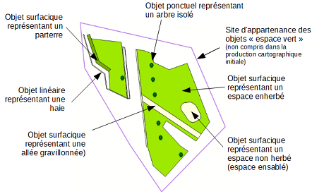
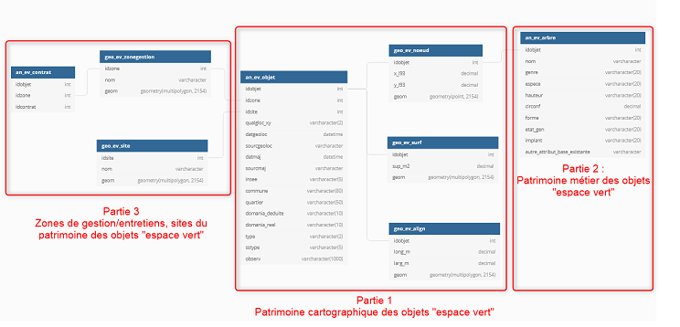

# Prescriptions spécifiques (locales) pour la gestion des espaces verts

# Documentation du standard

# Changelog

- 09/11/2020 : description initiale du gabarit de production et de mise à jour des espaces verts

# Livrables

## Gabarits

- Fichier hors gabarit des espaces verts à télécharger au format shape (géographique)
- Fichier gabarit Qgis 3.x (vierge) complet à télécharger

## Principe fonctionnel

Le principe de fonctionnement de la base de données de gestion des espaces verts s'appuie sur la production cartographique d'objets constituant cet espace définit comme un espace d'agrément planté de fleurs, d'arbustes, d'arbres ou engazonné. Il peut être, dans certains cas, complété par des parties minérales ou hydrographiques. Il doit être ouvert au public et facilement accessible par des modes doux (schéma 1). 

Ces objets peuvent être représentés de façon surfacique (espace enherbé, parterre, bois...), linéaire (haie, accotement...) ou ponctuel (arbre en alignement, pot...). Ils sont intégrés à la fois dans un site cohérent (équipements publics, ensemble urbain, voie...) et dans une zone de gestion et/ou intervention.

Le principe du modèle de données (schéma 2) prend ainsi en compte la production initiale cartographique des objets en y intégrant des notions d'appartenance cohérente à des zones de gestion, d'intervention ou de production cartographique d'ensemble (site...). Il rend également possible l'affectation d'éléments de gestion de ce patrimoine cartographique au besoin du service dans un temps plus long. Cette production initiale doit permettre dans un premier temps de reconstituion un plan masse des espaces verts.

Schéma 1 : les objets de la production cartographique

Schéma 2 : principe de modélisation autour de 3 blocs de production

**Ce schéma montre la prise en compte dans le modèle de donnée de la périodicité d'intégration par le service "espace vert" des différents éléments lui permettant à terme de gérer l'ensemble de son patrimoine de données. La production cartographique des objets (partie 1) constituant les espaces verts, maillon de base permettant de générer le gabarit de saisie, elle sera entièrement décrite dans cette première phase de la documentation ci-après. Les parties 2 et 3, même si elles sont évoquées et en partie intégrées dans cette première modélisation, seront développées dans un second temps.**

(à venir après validation du modèle de données)

Schéma 3 : restitution conceptuelle dans la base de données

## Production cartographique initiale attendue en 2020 

**Cette production cartographique initiale des objets des espaces verts consiste en 3 points :**

- compléter l'inventaire initié par le service "Espace Vert" existant concernant le positionnement des arbres isolés ou en alignement sur la commune de Compiègne,
- compléter et mettre à jour une production cartographique initiée en 2018 sur la commune de Compiègne (hors arbre). Cette donnée pourra être reprise par le prestataire afin d'en améliorer la qualité de précision des objets recensés,
- produire les objets des espaces verts sur les zones d'aménagements (ZAE) gérées par l'Agglomération de la Région de Compiègne.

## Règle de modélisation

Les objets constituant la production cartographique initiale sont organisés autour des 3 primitives géographiques de base : polygones, lignes et points. **La saisie des objets de type multi n'est pas autorisé.**

La saisie de ces objets doit permettre une restitution de l'ordre du 1 000ème.

Chaque objet saisi devra être complété par des informations attributaires associées. Certains de ces attributs seront autogénérés par le gabarit, d'autres le seront à l'intégration de la production cartographique par le maître d'ouvrage et d'autres devront être saisis obligatoirement par le prestataire.

Le Maître d’ouvrage mettra à disposition du prestataire de l’opération de numérisation les référentiels cartographiques « institutionnels » en sa possession dans le gabarit de saisie, sous le logiciel SIG QGIS 3.x :

- Prise de vue orthophotographique régionale de 2018,
- filaire de voies,
- le référentiel PCI Vecteur au 1er janvier 2020.

D'autres fonds de plan peuvent être ajoutés si le prestataire en dispose. Dans ce cas il devra en informer le maître d'ouvrage et restituer ceux-ci dans le gabarit à la fin de la production cartographique.

Les objets produits dans le cadre de cet inventaire devront être en cohérence topologique avec la précision des référentiels fournis y compris si le prestataire dispose de ces propres fonds de plan.

La saisie des objets se fera donc :
- soit par numérisation sur ces référentiels cartographiques,
- soit par GPS ou autre technique de levées sur le terrain, à mettre en cohérence avec les référentiels si nécessaire.

Les objets de cette production cartographique doivent répondre aux conditions de saisies présent dans les 2 tableaux ci-après.

|Objets|Représentation|Définition|
|:---|:---|:---|
|Ponctuel planté (arbre)|Point|L'objet saisit doit représenter le centre du tronc pour les arbres d'une circonférence supérieure à 50cm. Pour les autres un point saisit à proximité immédiate est suffisant. Ces objets correspondent à des arbres isolés, en aligement ou dans des espaces publics aménagés.|
|Surface plantée (arbre)|Polygone|Dans le cas d'un espace boisé naturel d'un seul tenant, un polygone sera saisit avec une estimation du nombre d'arbres le composant|
|Surface enherbée|Polygone|Tout objet d'une largeur supérieure à 1 mètre.|
|Surface plantée|Polygone|Tout objet d'une largeur supérieure à 1 mètre.|
|Friche végétale|Polygone|Tout objet laissé en développement naturel ou l'intervention humaine est exceptionnelle.|
|Linéaire enherbée|Polyligne|Tout objet positionné sous forme d'accotement d'une largeur inférieure ou égale à 1 mètre. La ligne saisie représente le centre de l'accotement et la largeur est obligatoirement indiquée dans un attribut complémentaire.|
|Linéaire plantée|Polyligne|Tout objet positionné sous forme d'alignement, de haie ou en accotement d'une largeur inférieure ou égale à 1 mètre. La ligne saisie représente le centre de cet espace et la largeur est obligatoirement indiquée dans un attribut complémentaire.|

Tableau 1 : représentation des objets "espace vert" dans l'inventaire

|Objets|Représentation|Définition|
|:---|:---|:---|
|Ponctuel hydrographique (fontaine, point d'eau)|Point|L'objet saisit doit représenter son centre si celui-ci ne dispose pas d'un bassin intégré|
|Surface minérale|Polygone|Tout objet d'une largeur supérieure à 1 mètre|
|Surface hydrographique (fontaine, bassin, rivière...)|Polygone|Tout objet disposant d'une surface en eau au sol (avec ou sans système hydraulique) d'une largeur supérieure à 1 mètre|
|Linéaire minérale|Polyligne|Tout objet d'une largeur inférieure ou égale à 1 mètre|
|Linéaire hydrographique|Polyligne|Tout objet disposant d'une surface en eau au sol (avec ou sans système hydraulique) d'une largeur inférieure ou égale à 1 mètre|

Tableau 2 : représentation des objets d'habillage "espace vert" dans l'inventaire uniquement pour un site cohérent déterminé par un équipement public (parc,...)

### Système de coordonnées

Les coordonnées seront exprimées en mètre avec trois chiffres après la virgule dans le système national en vigueur.
Sur le territoire métropolitain s'applique le système géodésique français légal RGF93 associé au système altimétrique IGN69. La projection associée Lambert 93 France (epsg:2154) sera à utiliser pour la livraison des données.

### Topologie

- Tous les objets sont nécessairement inclu dans l'emprise de la commune de Compiègne et dans les zones d'aménagement (ZAE) gérées par l'Agglomération de la Région de Compiègne. 
- Ils sont également inclus dans un site de production cartographique correspondant à un équipement public, une voie... et dans une zone de gestion/intervention.  
- A l'intérieur d'une zone d'aménagement (ZAE) gérée par l'Agglomération de la Région de Compiègne, les objets devront être découpés avec les limites communales

Ces deux derniers éléments seront intégrés dans une phase ultérieure à la production cartographique initiale.

- Tous les objets de type "surface" sont des polygones fermés, et si ils sont adjacents, ils devront être topologique (absence de chevauchements et de micro-trous). 

 

- Un polygone contenant un autre polygone devra être découpé avec celui-ci.

- Les linéraires doivent être connnectés entre eux si ils sont contiguës dans la réalité du dessin saisi.

- Les arcs de cercle ou ellipse devront être numérisés sous forme de polyligne suffisamment détaillée pour en reproduire le forme.

## Format des fichiers

Les fichiers sont disponibles au format ESRI Shape (.SHP) contenant la géométrie.
L'encodage des caractères est en UTF8. Les différents supports sont téléchargeables dans la rubrique Gabarits.

## Description des classes d'objets

|Nom fichier|Définition|Catégorie|Géométrie|
|:---|:---|:---|:---|
|(table)|def|Patrimoine|Ponctuel|
(table)|def|Patrimoine|sans objet|

## Implémentation informatique

### Patrimoine

Ensemble des données décrivant les objets composant 

`table` : nom

|Nom attribut|Définition|Type|Valeurs|Contraintes|
|:---|:---|:---|:---|:---|
|attribut|||||

### Les identifiants

Les identifiants des objets des espaces verts sont des identifiants non signifiants (un simple numéro incrémenté de 1 à chaque insertion).

### Liste de valeurs

Le contenu des listes de valeurs est disponible dans la documentation complète de la base de données en cliquant [ici](/bdd/doc_admin_bd_tri.md) dans la rubrique `Liste de valeurs`.

