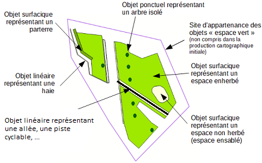
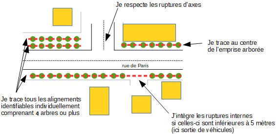
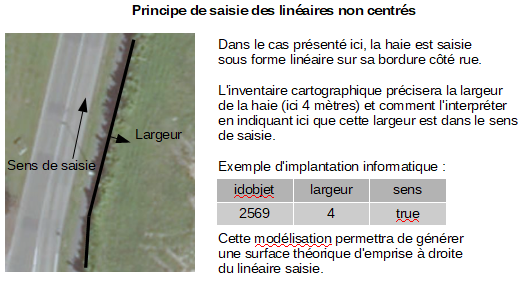
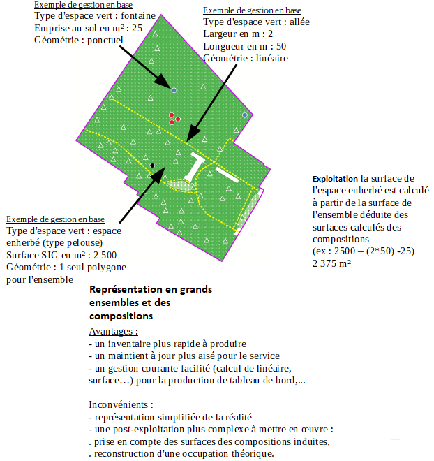
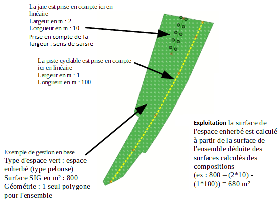

# Prescriptions spécifiques (locales) pour la gestion des espaces verts

# Documentation du standard

# Changelog

- 19/03/2021 : finalisation du gabarit et de la modélisation pour un inventaire cartographique
- 16/11/2020 : description initiale du gabarit de production des espaces verts

# Livrables

Le gabarit présenté ci-après s'organise autour de la production d'un inventaire cartographique des espaces verts géré par la collectivité. 
L'objectif principal est bien de recenser l'ensemble des objets participant à la structuration des espaces verts. En les typant par une nomenclature simple et compréhensible, cet inventaire peut-être produit par un nom spécialiste.

Néanmoins pour les besoins d'un service gérant les espaces verts, ce gabarit a été pensé pour deux autres usages : l'un permettant de détailler ces objets d'un point de vue métier et un autre dans une optique d'engagement de gestion des espaces verts (tableau de bord, intervention....).

Cet inventaire sera ainsi intégré à la base de données de la collectivité et pourra être également complété et mis à jour par le service métier à moyen et long terme.

## Gabarits

- Fichier hors gabarit des espaces verts à télécharger au format shape (géographique)
- Fichier gabarit Qgis 3.x (vierge) complet à télécharger

## Principe fonctionnel

Le principe de fonctionnement de la base de données devant intégrer l'inventaire des espaces verts s'appuie sur la production cartographique d'objets métiers définit comme un espace d'agrément planté de fleurs, d'arbustes, d'arbres ou engazonné. 
Il peut être, dans certains cas, complété par des parties minérales ou hydrographiques. Il doit être ouvert au public et facilement accessible par des modes doux. 

Ces objets peuvent être représentés de façon surfacique (espace enherbé, planté...), linéaire (haie, chemin,...) ou ponctuel (arbre...). Ils sont intégrés à la fois dans un site cohérent (équipements publics, ensemble urbain, voie...) et dans une zone de gestion et/ou intervention.

L'inventaire cartographique ne s'attachera pas à ce stade à la défintion des sites cohérents et aux zones de gestion.

Tous les objets saisis sont typés à partir d'une nomenclature métier d'objets "espace vert" afin de les définir individuellement.

Schéma 1 : une représentation des objets d'un inventaire cartographique

## Règle de modélisation

### Règles générales

Les objets constituant l'inventaire cartographique initial sont organisés autour des 3 primitives géographiques de base : polygones, lignes et points. **La saisie des objets de type multi n'est pas autorisée.**

La saisie de ces objets doit permettre une restitution de l'ordre du 1 000ème.

Les objets produits dans le cadre de cet inventaire devront être en cohérence topologique avec la précision des référentiels utilisés.

L'inventaire cartographique se fera préférentiellement :
- soit par numérisation sur des référentiels cartographiques (intégré aux gabarits),
- soit par un levé de terrain.

### La modélisation

Les règles de modélisation consiste à présenter la façon dont les objets doivent être saisis et restitués dans le gabarit.

La modélisation choisie est la non prise en compte des ruptures sous forme surfacique pour conserver l'homogénéisation d'usages des objets.
Ces ruptures, dans un site cohérent ou non, venant interrompres cette homogénéisation sont représentées sous forme linéaires avec des attributs les qualifiants (longueur, largeur...). 
Ces attributs complémentaires permettent ainsi de réaliser plus facilement des calculs d'exploitation (linéaire de haies, ...)

Cette orientation assumée, est censée être plus proche d'une gestion de service mais ne permet pas une restitution graphique exacte des objets "espace vert". La production d'un inventaire cartographique et de sa mise à jour (interne ou non) est jugée plus rapide. A contrario, l'exploitation des données devra prendre en compte les particularités de cette modélisation pour restituer au mieux une réalité en terme de surfaces.
Pour rappel, c'est cette approche qui a été utilisée pour un premier inventaire réalisé en 2018 mais sans intégrer cette notion d'attributs complémentaires. Celui-ci devant être ré-intégré à la nouvelle base de données, cette option est la moins impactante. Seuls les attributs qualitatifs de longueurs ou de largeurs devront être complétés, ce qui pourra être réalisés par le service métier.

Des règles de modélisation de base peuvent ainsi être édictées :

- les objets ponctuels de compositions sont représentés sous forme de point sans limite d'emprise au sol. 

- un objet représenté par un polygone, pour une surface identifiée sur le terrain. Toute surface végétalisée doit être saisie.

- un objet représenté par un linéaire, pour une surface identifiée sur le terrain, celle-ci doit être de forme linéaire et de largeur inférieure à 5 m. Un linéaire saisit est un ensemble homogène dans sa nomenclature et sa largeur. 

Des règles de modélisation plus fines peuvent être décrites :

|Classe d'objets|Type d'objets|Représentation|Définition|Règle de modélisation particulière|
|:---|:---|:---|:---|:---|
|PONCTUEL Espace vert|Arbre(1)|POINT|L'objet identifié sur le terrain est un arbre entretenu, localisé en diffus, en alignement, dans un contenant artificiel ou dans une zone boisée aménagée et entretenu.|Le point de saisie ou sa reconstruction (par au moins 3 points de levés) doit représenter le centre de l'objet identifié. A défaut, le bord du tronc peut-être accepté en indiquant le diamètre du tronc.|
|PONCTUEL Espace vert|Ponctuel fleuri|POINT|L'objet identifié sur le terrain est un espace fleuri hors sol dans un contenant artificiel (jardinière, pot, suspension ...).|Le point de saisie ou sa reconstruction (par au moins 3 points de levés) doit représenter le centre de l'objet identifié.|
|LINEAIRE Espace vert|Alignement d'arbres(1)|LINEAIRE|L'objet identifié sur le terrain est une bande arborée, composé d'une série d'arbres entretenus continus (au moins 4), le long d'un axe routier ou piéton.|Le linéaire saisit correspond au centre de l'emprise de l'alignement. Les ruptures de voirie ou d'entrées dans l'espace privé (garage, entrée ...) devront être respectées si celles-ci sont supérieures à 5 mètres. Dans le cas contraire ces espaces sont intégrés dans le linéaire. Chaque alignement doit être identifié. Se référer au schéma ci-dessous.|
|LINEAIRE Espace vert|Haie|LINEAIRE|L'objet identifié sur le terrain est une bande arbustive d'un seul tenant intégrée ou non à une espace enherbé d'une largeur ingérieur à 5m sinon il s'agit d'un espace planté (massif). |Le tracé de la ligne est saisi au centre de l'emprise au sol de l'objet ou à défaut sur une bordure en précisant si la largeur doit être prise en compte dans le sens de saisie. Une information de largeur est obligatoirement saisie. Les ruptures de voirie ou d'entrées dans l'espace privé (garage, entrée ...) devront être respectées si celles-ci sont supérieures à 5 mètres. Dans le cas contraire ces espaces sont intégrés dans le linéaire.Se référer au schéma ci-dessous.|
|LINEAIRE Espace vert|Accotement enherbé|LINEAIRE|L'objet identifié sur le terrain est une bande enherbé d'un seul tenant d'une largeur ingérieur à 5m sinon il s'agit d'un espace enherbé (type pelouse). |Le tracé de la ligne est saisi au centre de l'emprise au sol de l'objet ou à défaut sur une bordure en précisant si la largeur doit être prise en compte dans le sens de saisie. Une information de largeur est obligatoirement saisie. Les ruptures de voirie ou d'entrées dans l'espace privé (garage, entrée ...) devront être respectées si celles-ci sont supérieures à 5 mètres. Dans le cas contraire ces espaces sont intégrés dans le linéaire.Se référer au schéma ci-dessous.|
|LINEAIRE Espace vert|Accotement fleuri|LINEAIRE|L'objet identifié sur le terrain est un massif fleuri sous forme de bande d'un seul tenant d'une largeur ingérieur à 5m sinon il s'agit d'un espace fleuri (massif). |Le tracé de la ligne est saisi au centre de l'emprise au sol de l'objet ou à défaut sur une bordure en précisant si la largeur doit être prise en compte dans le sens de saisie. Une information de largeur est obligatoirement saisie. Les ruptures de voirie ou d'entrées dans l'espace privé (garage, entrée ...) devront être respectées si celles-ci sont supérieures à 5 mètres. Dans le cas contraire ces espaces sont intégrés dans le linéaire.Se référer au schéma ci-dessous.|
|LINEAIRE Minéral|Circulation douce|LINEAIRE|L'objet identifié sur le terrain est un axe de circulation doux (piéton ou 2 roues) décomposant un espace enherbé ou planté homogène d'une largeur inférieure à 5 mètres, sinon il s'agit d'un espace minéral. |Le tracé de la ligne est saisi au centre de l'emprise au sol de l'objet ou à défaut sur une bordure en précisant si la largeur doit être prise en compte dans le sens de saisie. Une information de largeur est obligatoirement saisie. Se référer au schéma ci-dessous.|
|SURFACE Espace vert|Zone boisée|POLYGONE|L'objet identifié sur le terrain est un ensemble d'arbres dense, aménagé et faisant l'objet d'un entretien courant. |Celles-ci doivent être identifiées sous forme de polygone et comme pour les alignements d'arbres accompagnés d'une représentation ponctuelle de chaque arbre. Les secteurs boisés naturels sont représentés uniquement par un polygone. |
|SURFACE Espace vert|Espace enherbé|POLYGONE|L'objet identifié sur le terrain est un ensemble enherbé, homogène, entretenu et de même type, d'une largeur supérieure à 5m et non linéaire sinon il s'agit d'un accotement.|Les objets intégrant cet espace, de forme linéaire, d'une largeur inférieure à 5 mètres en sont exclus pour représenter une forme homogène (cf règle de modélisation édictées en introduction). Se référer au schéma ci-dessous.|
|SURFACE Espace vert|Espace planté|POLYGONE|L'objet identifié sur le terrain est un espace fleuri ou un massif au sol.|Pas de surface minimum, tout objet doit-être saisi. Pour rappel Les accotements fleuris sont saisis comme des linéaires si leur largeur est inférieure à 5m et disposé de façon linéaire.|
|SURFACE Espace minéral|Espace minéral|POLYGONE|L'objet identifié sur le terrain est une zone minérale intégrant un espace cohérent d'espace vert (type parc).|Pas de surface minimum, tout objet doit-être saisi. Pour rappel les éléments minérals de rupture (circulation douce) inférieure à 5m sont saisis en linéaire.|

(1) Les arbres en alignement font l'objet d'une double saisie, ponctuel et linéaire
(2) niveau de la nomenclature

La saisie des objets linéaires répond à des particularités décrites ci-dessous.

**Synthèses**

**Dans un site cohérent (parc, square ...) :** 

**En dehors d'un site cohérent (espace végétalisé diffus, trottoir végétalisé, accotement ...) :** 

Les objets de cet inventaire cartographique doivent répondre aux conditions de saisies présent ci-après.

### Topologie

La cohérence topologique impose le partage de géométrie et donc l’utilisation des outils « d’accroches ».

- Tous les objets sont nécessairement inclu dans une emprise communale.
- Ils sont également inclus dans un site (équipement public, une voie...). 
- Les objets devront être découpés avec les limites communales et les zones de gestion existantes.

Ces deux derniers éléments seront intégrés dans une phase ultérieure à l'inventaire cartographique initial.

- Tous les objets de type "surface" sont des polygones fermés, et si ils sont adjacents, ils devront être topologique (absence de chevauchements et de micro-trous). 

 

- Un polygone contenant un autre polygone devra être découpé avec celui-ci.

- Les linéraires doivent être connectés entre eux si ils sont contiguës dans la réalité du dessin saisi.

- Les arcs de cercle ou ellipse devront être numérisés sous forme de polyligne suffisamment détaillée pour en reproduire la forme.

### Système de coordonnées

Les coordonnées seront exprimées en mètre avec trois chiffres après la virgule dans le système national en vigueur.
Sur le territoire métropolitain s'applique le système géodésique français légal RGF93 associé au système altimétrique IGN69. La projection associée Lambert 93 France (epsg:2154) sera à utiliser pour la livraison des données.

## Format des fichiers

Les fichiers sont disponibles au format ESRI Shape (.SHP) contenant la géométrie.
L'encodage des caractères est en UTF8. Les différents supports sont téléchargeables dans la rubrique Gabarits.

## Description des classes d'objets

|Nom fichier|Définition|Catégorie|Géométrie|
|:---|:---|:---|:---|
|geo_v_ev_point|Localisation des objets "espace vert" de représentation ponctuelle|Inventaire cartographique|Ponctuel|
|geo_v_ev_polygon|Délimitation des objets "espace vert" de représentation surfacique|Inventaire cartographique|Polygone|
|geo_v_ev_line|Tracé des objets "espace vert" de représentation rectiligne|Inventaire cartographique|Linéaire|

## Implémentation informatique

### Patrimoine

Ensemble des données décrivant les objets composant l'inventaire cartographique des espaces verts. 

`geo_v_ev_point` : fichier contenant les objets "espace vert" de type ponctuel

|Nom attribut|Définition|Type|Valeurs|Contraintes|Observations|
|:---|:---|:---|:---|:---|:---|
|idobjet|Identifiant unique des objets|integer|Incrémentation automatique valeur max(idobjet)+1|NOT NULL||
|typev1|Nomenclature de niveau 1 identifiant le type d'espace vert|character varying(1)|Liste de valeurs lt_ev_typev1|NOT NULL||
|typev2|Nomenclature de niveau 2 identifiant le type d'espace vert|character varying(3)|Liste de valeurs lt_ev_typev2|NOT NULL||
|srcgeom_sai|Référentiel de saisie|character varying(2)|Liste de valeurs lt_src_geom|NOT NULL||
|srcdate_sai|Année du référentiel de saisie|integer||NOT NULL||
|qualglocxy|Incertitude maximale de la précision de saisie en cm|integer||NOT NULL||
|op_sai|Opérateur de saisie |character varying(50)||NOT NULL||
|dat_sai|Date de saisie |Date|now()|NOT NULL|Valeur calculée automatiquement à la saisie|
|observ|Commentaires divers |character varying(254)||||
|surf_e|Surface d'emprise au sol en m²|integer|||(en fonction des choix de modélisation retenue)|

`geo_v_ev_polygon` : fichier contenant les objets "espace vert" de type surfacique

|Nom attribut|Définition|Type|Valeurs|Contraintes|Observations|
|:---|:---|:---|:---|:---|:---|
|idobjet|Identifiant unique des objets|integer|Incrémentation automatique valeur max(idobjet)+1|NOT NULL||
|typev1|Nomenclature de niveau 1 identifiant le type d'espace vert|character varying(1)|Liste de valeurs lt_ev_typev1|NOT NULL||
|typev2|Nomenclature de niveau 2 identifiant le type d'espace vert|character varying(3)|Liste de valeurs lt_ev_typev2|NOT NULL||
|srcgeom_sai|Référentiel de saisie|character varying(2)|Liste de valeurs lt_src_geom|NOT NULL||
|srcdate_sai|Année du référentiel de saisie|integer||NOT NULL||
|qualglocxy|Incertitude maximale de la précision de saisie en cm|integer||NOT NULL||
|op_sai|Opérateur de saisie |character varying(50)||NOT NULL||
|dat_sai|Date de saisie |Date|now()|NOT NULL||
|observ|Commentaires divers |character varying(254)||||
|sup_m²|Surface du polygone saisie en mètre carré|integer|$area|NOT NULL|Valeur calculée automatiquement à la saisie|
|perimetre|Périmètre du polygone saisie en mètre|integer|$perimetre|NOT NULL|Valeur calculée automatiquement à la saisie|

`geo_v_ev_line` : fichier contenant les objets "espace vert" de type linéaire

|Nom attribut|Définition|Type|Valeurs|Contraintes|Observations|
|:---|:---|:---|:---|:---|:---|
|idobjet|Identifiant unique des objets|integer|Incrémentation automatique valeur max(idobjet)+1|NOT NULL||
|typev1|Nomenclature de niveau 1 identifiant le type d'espace vert|character varying(1)|Liste de valeurs lt_ev_typev1|NOT NULL||
|typev2|Nomenclature de niveau 2 identifiant le type d'espace vert|character varying(3)|Liste de valeurs lt_ev_typev2|NOT NULL||
|srcgeom_sai|Référentiel de saisie|character varying(2)|Liste de valeurs lt_src_geom|NOT NULL||
|srcdate_sai|Année du référentiel de saisie|integer||NOT NULL||
|qualglocxy|Incertitude maximale de la précision de saisie en cm|integer||NOT NULL||
|op_sai|Opérateur de saisie |character varying(50)||NOT NULL||
|dat_sai|Date de saisie |Date|now()|NOT NULL||
|observ|Commentaires divers |character varying(254)||||
|long_m|Longueur du tracé saisie en mètre|integer|$length|NOT NULL|Valeur calculée automatiquement à la saisie|
|larg_cm|Largeur du tracé saisie en centimètre|integer||NOT NULL||

### Liste de valeurs

Le contenu des listes de valeurs est disponible dans la documentation complète de la base de données en cliquant [ici](/bdd/doc_admin_bd_ev.md) dans la rubrique `Liste de valeurs`.

Cependant, pour des questions de compréhension, la nomenclature définissant le type des objets "espace vert" est présentée ci-dessous. Pour l'inventaire cartographique, seuls les 2 premiers niveaux de nomenclature sont imposés.

`lt_ev_typev1` : liste des valeurs de la nomenclature de niveau 1 permettant de décrire les objets de l'inventaire cartographique des espaces verts

|Code|Valeur|
|:---|:---|
|1|Végétal|
|2|Minéral|
|3|Hydrographie|
|9|Référence non classée|

`lt_ev_typev2` : liste des valeurs de la nomenclature de niveau 2 permettant de décrire les objets de l'inventaire cartographique des espaces verts

|Code|Valeur|
|:---|:---|
|101|Arbre|
|102|Espace enherbé|
|103|Espace planté|
|104|Ponctuel fleuri|
|105|Haie, mur|
|106|Friche|
|201|Allée|
|202|Clôture|
|203|Zone de rencontre|
|204|Accès|
|205|Equipement|
|301|Bassin|
|302|Points d'eau|
|303|Cours d'eau|
|999|Référence non classée|

`lt_src_geom` : liste des valeurs des référentiels de saisis disponibles
|Code|Valeur|
|:---|:---|
|00|Non renseigné|
|20|Ortho-images|
|22|Orthophotoplan partenaire|
|50|Lever|
|51|Plan topographique|
|53|Trace GPS|
|99|Autre|

### Les identifiants

Les identifiants des objets des espaces verts sont des identifiants non signifiants (un simple numéro incrémenté de 1 à chaque insertion).

