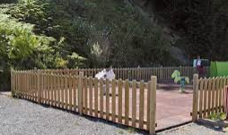

# Prescriptions spécifiques (locales) pour la gestion des espaces verts

# Documentation du standard

# Changelog

- 29/03/2021 : finalisation du gabarit et de la modélisation pour un inventaire cartographique
- 16/11/2020 : description initiale du gabarit de production des espaces verts

# Livrables

Le gabarit présenté ci-après s'organise autour de la production d'un inventaire cartographique des espaces verts.
Il peut être utilisé indistinctement pour la saisie des espaces verts situés :
 * en domaine public,
 * en domaine privé communal ou intercommunal, 
 * en domaine privé non clos (accessible depuis l'espace public).
 
En les typant par une nomenclature simple et compréhensible, cet inventaire peut-être produit par un non spécialiste.

Néanmoins pour les besoins d'un service gérant les espaces verts, ce gabarit a été pensé pour deux autres usages : l'un permettant de détailler ces objets d'un point de vue métier et l'autre dans une optique d'engagement de gestion des espaces verts (tableau de bord, interventions....).

Pour cette raison, la production des objets des "espaces verts" est accompagnée par certains attributs complémentaires à renseigner dans le gabarit.

Cet inventaire sera ainsi intégré à la base de données de la collectivité et pourra être également complété et mis à jour par le service métier.

## Gabarits

- Fichier gabarit Qgis 3.1x (vierge) complet à télécharger

## Principe fonctionnel

Le principe de fonctionnement de la base de données devant intégrer l'inventaire des espaces verts s'appuie sur la production cartographique d'objets métiers définis comme un espace d'agrément planté de fleurs, d'arbustes, d'arbres ou engazonné. 

Ces objets peuvent être représentés de façon surfacique (espace enherbé, planté ...), linéaire (haie, chemin ...) ou ponctuel (arbre, pot ...). 

**Dans les sites cohérents (parc, square, coulée verte urbaine, pénétrante ...), les objets "espace vert" sont complétés par des parties minérales ou hydrographiques. En dehors, seuls les objets spécifiques aux espaces verts sont saisis.**

L'inventaire cartographique ne s'attachera pas à la définition des sites cohérents et des zones de gestion, et ne devra pas tenir compte des règles topologiques liées à ces données.

Toutes les classes d'objets du gabarit sont typées à partir d'une nomenclature métier d'objets "espace vert" afin de les définir individuellement.

 à refaire

Schéma 1 : une représentation des objets d'un inventaire cartographique

## Règle de modélisation

### Règles générales

Les objets constituant l'inventaire cartographique initial sont organisés autour des 3 primitives géographiques de base : polygones, lignes et points. **La saisie des objets de type multi n'est pas autorisée.**

La saisie de ces objets doit permettre une restitution de l'ordre du 1/1000e.

Les objets produits dans le cadre de cet inventaire devront être en cohérence topologique avec la précision des référentiels utilisés.

L'inventaire cartographique se fera préférentiellement :
- soit par numérisation sur des référentiels cartographiques (intégrés aux gabarits),
- soit par un levé de terrain.

### La modélisation

Les règles de modélisation consistent à présenter la façon dont les objets doivent être saisis et restitués dans le gabarit.

La modélisation choisie est la non prise en compte des ruptures sous forme surfacique pour conserver l'homogénéisation d'usage des objets.
Ces ruptures, dans un site cohérent ou non, venant interrompre cette homogénéisation, sont représentées sous forme linéaire avec des attributs les qualifiant ( largeur, type de saisie ...). 
Ces attributs complémentaires propres aux objets des espaces verts permettent ainsi de réaliser plus facilement des calculs d'exploitation (linéaire de haies, ...).

Cette orientation assumée, est censée être plus proche d'une gestion de service mais ne permet pas une restitution graphique exacte des objets "espace vert". La production d'un inventaire cartographique et de sa mise à jour (interne ou non) est jugée plus rapide. A contrario, l'exploitation des données devra prendre en compte les particularités de cette modélisation pour restituer au mieux une réalité en terme de surface.

#### Présentation simplifiée de la nomenclature 

#### Modélisation simplifiée des classes d'objets du gabarit par type de géométrie permis

|Classe d'objets|Point|Ligne|Polygone|
|:---|:---|:---|:---|
|Arbre isolé|X|||
|Alignement d'arbres||X||
|Zone boisée|||X|
|Arbuste isolé|X|||
|Haie||X <5m de large||
|Massif arbustif|X <5m²||X >5m²|
|Fleuri isolé|X|||
|Massif fleuri|X <5m²||X >5m²|
|Espace enherbé|||X >25m²|
|Circulation voie||X||
|Circulation espace|||X|
|Clôture||X||
|Stationnement|||X|
|Equipement récréatif|||X|
|Points d'eau|X|||
|Cours d'eau||X||
|Etendue d'eau|X <5m²||X >5m²|

#### Modélisation détaillée des objets du gabarit à saisir

|Classe d'objets|Représentation|Définition et règle|Type d'objets saisis|Schéma de principe|
|:---|:---|:---|:---|:---|
|Arbre isolé (1)|POINT|Arbre entretenu, localisé en diffus, en alignement, dans un contenant artificiel ou dans une zone boisée aménagée et entretenue. L'objet restitué doit correspondre au centre de celui-ci.|arbre||
|Alignement d'arbres (1)|LINEAIRE|Bande arborée, composée d'une série d'arbres entretenus continue (au moins 4), le long d'un axe routier ou piéton. Le linéaire saisi correspond au centre de l'emprise de l'alignement. Les ruptures de voirie devront être respectées. Chaque alignement doit être identifié.|arbre||
|Zone boisée|POLYGONE|Ensemble d'arbres dense essentiellement d'ambiance naturel. Pour rappel, les arbres dans une zone boisée, situés dans un site cohérent (parc ...) doivent être saisis individuellement sur un espace délimité (enherbé, massif arbustif ...).|boisement d'ambiance naturel||
|Arbuste isolé|POINT|Arbuste entretenu, localisé en diffus, dans un contenant artificiel ou non. L'objet restitué doit correspondre au centre de celui-ci.|arbuste||
|Haie|LINEAIRE|Bande arbustive d'un seul tenant intégrée ou non à un espace enherbé d'une largeur inférieure à 5m sinon il s'agit d'un massif arbustif. Les ruptures de cohérence devront être respectées. Le tracé de la ligne est saisi au centre de l'emprise au sol de l'objet ou à défaut sur une bordure en précisant si la largeur doit être prise en compte dans le sens de saisie. Une information de largeur est obligatoirement renseignée. Les ruptures de voirie devront être respectées.|arbuste| |
|Massif arbustif|POLYGONE|Massif arbustif au sol ou hors sol d'une surface supérieure à 5m².|Pour rappel, si la surface est inféreure à 5m², cet espace est représenté dans la classe "Arbuste isolé".||
|Fleuri isolé|POINT|Espace fleuri hors sol dans un contenant artificiel (bacs, pots, jardinière, suspension ...) inférieur à 5m². L'objet restitué doit correspondre au centre de celui-ci.|fleur en pot, en bac, en jardinière||
|Massif fleuri|POLYGONE|Massif fleuri au sol ou hors sol supérieur à 5m². Pour rappel, si la surface est inféreure à 5m², cet espace est représenté dans la classe "Fleuri isolé".|fleur en massif, jardinière||
|Espace enherbé|POLYGONE|Ensemble enherbé, homogène, entretenu et de même type, d'une surface supérieure à 25m². Pour rappel, les objets intégrant cet espace (circulation douce, haie ...) de forme linéaire, créant ainsi des ruptures, sont saisis sous forme de linéaire.|pelouse, gazon ...||
|Circulation voie|LINEAIRE|Axe de circulation doux, homogène décomposant un espace enherbé ou planté d'une largeur inférieure à 5 mètres en moyenne, sinon il s'agit d'un espace de circulation. Une largeur est obligatoirement renseignée. Le tracé de la ligne est obligatoirement saisi au centre de l'emprise au sol de l'objet.|allée, piste cyclable ...||
|Circulation espace|POLYGONE|Zone minérale de rencontre intégrant un espace cohérent d'espace vert (parc, square ...). Pas de surface minimum, tout objet doit-être saisi. Pour rappel les éléments minéraux de rupture (allée, circulation douce ...) sont saisis dans la classe "Circulation voie".|place, parvis ...||
|Clôture|LINEAIRE|Délimitation non naturelle fermant un site cohérent (parc, square ...) ou un sous-ensemble (aire de jeux dans un parc ...) . Le tracé de la ligne est obligatoirement au pied de l'emprise au sol de l'objet.|mur, grillage, palissade ...)||
|Stationnement|POLYGONE|Zone de stationnement identifiée intégrant un espace cohérent d'espace vert (parc, square ...). Pas de surface minimum, tout objet doit-être saisi.|parking, aire de stationement ...||
|Equipement récréatif|POLYGONE|Zone récréative intégrée ou non à un site cohérent. Pas de surface minimum, tout objet doit-être saisi. Pour rappel, si cet espace est clôturé, la clôture doit être saisie dans la classe d'objet "Clôture".|aire de jeux||
|Points d'eau|POINT|Equipement hydrographique contenu dans un site cohérent (parc, square ...). Les bassins ou étendues d'eau sont représentés ici s'ils sont inférieurs à 5m². L'objet restitué doit correspondre au centre de celui-ci.|fontaine, point d'eau, marre de moins de 5m² ...||
|Cours d'eau|POINT|Cours d'eau naturel ou non décomposant un espace enherbé ou planté d'une largeur inférieure à 5 mètres en moyenne, sinon il s'agit d'une étendue d'eau. Une largeur est obligatoirement renseignée. Le tracé de la ligne est obligatoirement saisi au centre de l'emprise au sol de l'objet.|ru, rivière||
|Etendue d'eau|POLYGONE|Surface en eau supérieure à 5m² intégrant un espace cohérent d'espace vert (parc, square ...). Pour rappel, si la surface est inférieure à 5m², l'objet sera représenté en ponctuel.|bassin, marre, étang ...||

(1) Les arbres en alignement font l'objet d'une double saisie, ponctuel et linéaire

#### Classes d'attributs complémentaires propre à certains objets

Certaines classes d'objets doivent faire l'objet de complétude par des attributs complémentaires qualitatifs. Le tableau ci-dessous indique les classes d'objets du gabarit qui sont concernées et les attributs à saisir (les valeurs possibles sont listées à la suite du tableau).

|Classe d'objets|Type de saisie (1)|Position (2)|Niveau d'entretien (3)|Largeur|
|:---|:---|:---|:---|:---|
|Arbre isolé||X|X||
|Alignement d'arbres||X|X||
|Zone boisée||X|X||
|Arbuste isolé||X|X||
|Haie|X|X|X|X|
|Massif arbustif||X|X||
|Fleuri isolé||X|X||
|Massif fleuri||X|X||
|Espace enherbé||X|X||
|Circulation voie||||X|
|Cours d'eau||||X|

(1)  Type de saisie : liste des valeurs décrivant le type de saisie de la sous-classe de précision des objets espace vert de type haie

|Code|Valeur|
|:---|:---|
|10|Largeur à appliquer au centre du linéaire|
|20|Largeur à appliquer dans le sens de saisie|
|30|Largeur à appliquer dans le sens inverse de saisie|

(2) Position : liste des valeurs décrivant la position des objets "espace vert" de type végétal

|Illustration|Code|Valeur|
|:---|:---|:---|
||10|Sol|
||20|Hors-sol (non précisé)|
||21|Pot|
||22|Bac|
||23|Jardinière|
||24|Suspension|
||29|Hors-sol (autre type)|

(3) Niveau d'entretien : liste des valeurs décrivant le niveau d'entretien des objets "espace vert" de type végétal

|Illustration|Code|Valeur|Définition et exemple|
|:---|:---|:---|:---|
||10|Espace entretenu, jardiné|Espace faisant l'objet d'un aménagement et d'un entretien courant : parc, square, massif ...|
||20|Espace rustique|Naturelle ou libre, la flore est laissée en place mais elle est cadrée par quelques interventions de l’équipe d’entretien. Elle peut aussi être associée à des espaces plantés ou semés. Ces espaces sont d’une taille importante et sont essentiels à la trame verte et bleue : liaison douce, bassin d’orage, coulée verte, prairie fleurie ...|
||30|Espace naturel| Développement de la flore spontanée avec peu voir pas d'interventions : berge, zone humide, zone boisée, friche ....|

#### Exemples d'applications de la modélisation

**Dans un site cohérent (parc, square ...) :** 

**En dehors d'un site cohérent (espace végétalisé diffus, trottoir végétalisé, accotement ...) :** 

Les objets de cet inventaire cartographique doivent répondre également aux règles topologiques présentées ci-après.

### Topologie

La cohérence topologique impose le partage de géométrie et donc l’utilisation des outils « d’accroches ».

- Tous les objets sont nécessairement inclus dans une emprise communale.
- Tous les objets sont inclus dans un site cohérent ou non (équipement public, voie ...). 
- Les objets devront être découpés avec les limites communales et les zones de gestion existantes.

- Tous les objets de type "surface" sont des polygones fermés, et s'ils sont adjacents, ils devront être topologiques (absence de chevauchements et de micro-trous). 

 

- Un polygone contenant un autre polygone devra être découpé avec celui-ci.

- Les linéraires doivent être connectés entre eux s'ils sont contigus dans la réalité du dessin saisi.

- Les arcs de cercle ou ellipses devront être numérisés sous forme de polyligne suffisamment détaillée pour en reproduire la forme.

### Système de coordonnées

Les coordonnées seront exprimées en mètres avec trois chiffres après la virgule dans le système national en vigueur.
Sur le territoire métropolitain s'applique le système géodésique français légal RGF93 associé au système altimétrique IGN69. La projection associée Lambert 93 France (EPSG:2154) sera à utiliser pour la livraison des données.

## Format des fichiers

Les fichiers sont disponibles au format ESRI Shape (.SHP) contenant la géométrie.
L'encodage des caractères est en UTF8. Les différents supports sont téléchargeables dans la rubrique Gabarits.

## Description des classes d'objets

|Nom fichier|Définition|Catégorie|Géométrie|
|:---|:---|:---|:---|
|geo_ev_vegetal_arbreisole|Classe d'objets des arbres isolés|Inventaire cartographique|Ponctuel|

## Implémentation informatique

### Patrimoine

Ensemble des données décrivant les objets composant l'inventaire cartographique des espaces verts ainsi que les attributs complémentaires spécifiques à certaines classes d'attributs. 

`[SHAPE NAME]` : fichier contenant les objets "[NAME]" de type [GEOM]

|Nom attribut|Définition|Type|Valeurs|Contraintes|Observations|
|:---|:---|:---|:---|:---|:---|

### Liste de valeurs

Le gabarit intègre déjà le découpage des 3 niveaux de nomenclature en terme d'objets "espace vert" à saisir. Seul le niveau 3 est présenté ci-dessous car il montre également des illustrations permettant de mieux déterminer les objets à saisir.

 * Nomenclature des objets "espace vert" de niveau 3
 

|Illustration|Code|Valeur|
|:---|:---|:---|
||10111|Arbre isolé|
||10112|Arbre en alignement|
||10113|Zone boisée|
||10119|Autre|
||10211|Arbuste isolé|
||10212|Haie arbustive|
||10213|Massif arbustif|
||10219|Autre|
||10311|Point fleuri|
||10312|Massif fleuri|
||10319|Autre|
||10411|Pelouse, gazon|
||10419|Autre|
||20111|Allée|
||20112|Piste cyclable|
||20119|Autre|
||20211|Mur|
||20212|Grillage|
||20213|Palissage|
||20219|Autre|
||20311|Parking matérialisé|
||20312|Espace de stationnement libre|
||20319|Autre|
||20411|Aire de jeux|
||20419|Autre|
||30111|Fontaine|
||30112|Point d'accès à l'eau|
||30119|Autre|
||30211|Rivière|
||30213|Ru|
||30219|Autre|
||30311|Bassin|
||30312|Marre|
||30313|Etang|
||30319|Autre|
||99000|Référence non classée|

### Les identifiants

Les identifiants des objets des espaces verts sont des identifiants non signifiants (un simple numéro incrémenté de 1 à chaque insertion).

