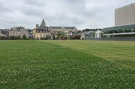

# Prescriptions locales pour l'inventaire cartographique des espaces verts

## Changelog

- 30/03/2021 : finalisation du gabarit et de la modélisation pour un inventaire cartographique
- 16/11/2020 : description initiale du gabarit de production des espaces verts

## Livrables

Le gabarit présenté ci-après s'organise autour de la production d'un inventaire cartographique des espaces verts.
Il peut être utilisé indistinctement pour la saisie des espaces verts situés :
 * en domaine public,
 * en domaine privé communal ou intercommunal, 
 * en domaine privé non clos (accessible depuis l'espace public).

La typologie des espaces verts considérés ne requiert pas de connaissances particulières du domaine et permet donc une production des données par un cartographe.

L'inventaire sera intégré à la base de données de la collectivité et pourra être librement complété et mis à jour par celle-ci.

Il constitue le socle de compléments métiers permettant de mieux détailler les caractéristiques patrimoniales des espaces verts ainsi que leur entretien (gestion). Ces compléments de spécialistes ne font pas partie des présentes prescriptions.

### Gabarits

- Fichier gabarit Qgis 3.1x (vierge) complet à télécharger

### Désignation

Un espace vert désigne un espace végétal homogène d'agrément planté de fleurs, d'arbustes, d'arbres ou engazonné.
Il peut être représenté de façon surfacique (espace enherbé, planté ...), linéaire (haie ...) ou ponctuel (arbre, pot ...). 

En complément, dans un **site cohérent** (parc, square, coulée verte urbaine, ...), peuvent être associés des espaces minéraux (allée, aire de jeux ...) ou hydrographiques (bassin ...).

Ainsi, la distinction des différents types d'objets "espace vert" est possible via une nomenclature simplifiée ci-dessous.

### Règles de modélisation

#### Règles générales

La saisie de ces objets doit permettre une **restitution de l'ordre du 1/1000e**.

Le cadre prescriptif autorise des modalités d'inventaire variées sous réserve que la précision soit suffisante pour respecter l'échelle de restitution indiquée.
Ainsi, l'inventaire pourra se faire par :
- numérisation sur des référentiels cartographiques (intégrés aux gabarits),
- levé de terrain
- relévés aériens ou embarqués

Schéma 1 : Exemple de représentation des objets d'un inventaire cartographique

#### La modélisation géométrique

Les règles de modélisation consistent à présenter la façon dont les objets doivent être saisis et restitués dans le gabarit.

Les objets constituant l'inventaire cartographique initial sont organisés autour des 3 primitives géographiques de base : polygones, lignes et points. **La saisie des objets de type multi n'est pas autorisée.**

L'objectif poursuivi dans le cadre de l'inventaire n'est pas celui d'établir un dessin topographique précis mais bien de disposer d'une information nécessaire à la gestion et l'exploitation des espaces verts par la collectivité.
A ce titre, des mesures de simplification de la restitution graphique sont prises tout en permettant une rapidité d'exécution accrue pour la saisie initiale et la mise à jour des données. 

En conséquence, les objets surfaciques (pelouse, massif arbustif ...) doivent être adaptés comme suit par rapport aux objets linéaires (ex : allée, trottoir, bande cyclables etc...) :
* dans les cas où les objets linéaires les délimitent, les objets surfaciques sont "étendus" (schéma n°2 - cas 1)
* dans les cas où les objets linéaires les traversent, les objets linaires se surimposent aux objets surfaciques sans les découper (schéma n°2 - cas 2)

Cette simplification de "dessin" est compensée par des attributs descriptifs complémentaires (largeur des espaces linéaires concernés).

Schéma n°2 : Présentation du principe de modélisation des intéractions entres les objets surfaciques et linéaires

#### Modélisation simplifiée des classes d'objets du gabarit par type de géométrie

|Classe d'objets|Point|Ligne|Polygone|
|:---|:---|:---|:---|
|Arbre isolé|X|||
|Alignement d'arbres||X||
|Zone boisée|||X|
|Arbuste isolé|X|||
|Haie||X <5m de large||
|Massif arbustif|X <5m²||X >5m²|
|Fleuri isolé|X|||
|Massif fleuri|X <5m²||X >5m²|
|Espace enherbé|||X >25m²|
|Voie circulation||X||
|Zone de circulation|||X|
|Clôture||X||
|Loisirs isolé|X|||
|Espace de loisirs|||X|
|Arrivée d'eau|X|||
|Points d'eau|X|||
|Cours d'eau||X||
|Etendue d'eau|X <5m²||X >5m²|

#### Topologie

La cohérence topologique impose le partage de géométrie et donc l’utilisation des outils « d’accroches ».

- Tous les objets sont nécessairement inclus dans une emprise communale.
- Tous les objets sont inclus dans un site cohérent ou non (équipement public, voie ...). 
- Les objets devront être découpés avec les limites communales et les zones de gestion existantes.

- Tous les objets de type "surface" sont des polygones fermés, et s'ils sont adjacents, ils devront être topologiques (absence de chevauchements et de micro-trous). 

 

- Un polygone contenant un autre polygone devra être découpé avec celui-ci.

- Les linéraires doivent être connectés entre eux s'ils sont contigus dans la réalité du dessin saisi.

- Les arcs de cercle ou ellipses devront être numérisés sous forme de polyligne suffisamment détaillée pour en reproduire la forme.

### Règles de saisies

#### Les règles de saisies détaillées des objets du gabarit

|Classe d'objets|Représentation|Définition et règle|Type d'objets saisis|Schéma de principe|
|:---|:---|:---|:---|:---|
|Arbre isolé (1)|POINT|Arbre entretenu, localisé en diffus, en alignement, dans un contenant artificiel ou dans une zone boisée aménagée et entretenue. L'objet restitué doit correspondre au centre de celui-ci.|arbre||
|Alignement d'arbres (1)|LINEAIRE|Bande arborée, composée d'une série d'arbres entretenus continue (au moins 4), le long d'un axe routier ou piéton. Le linéaire saisi correspond au centre de l'emprise de l'alignement. Les ruptures de voirie devront être respectées. Chaque alignement doit être identifié.|arbre||
|Zone boisée|POLYGONE|Ensemble d'arbres dense essentiellement d'ambiance naturelle.|boisement d'ambiance naturelle||
|Arbuste isolé|POINT|Arbuste entretenu, localisé en diffus, dans un contenant artificiel ou non. L'objet restitué doit correspondre au centre de celui-ci.|arbuste||
|Haie|LINEAIRE|Bande arbustive d'un seul tenant intégrée ou non à un espace enherbé d'une largeur inférieure à 5m sinon il s'agit d'un massif arbustif. Les ruptures de cohérence devront être respectées. Le tracé de la ligne est saisi au centre de l'emprise au sol de l'objet ou à défaut sur une bordure en précisant si la largeur doit être prise en compte dans le sens de saisie. Une information de largeur est obligatoirement renseignée. Les ruptures de voirie devront être respectées.|arbuste| |
|Massif arbustif|POLYGONE|Massif arbustif au sol ou hors sol d'une surface supérieure à 5m².|||
|Fleuri isolé|POINT|Espace fleuri hors sol dans un contenant artificiel (bacs, pots, jardinière, suspension ...) inférieur à 5m². L'objet restitué doit correspondre au centre de celui-ci.|fleur en pot, en bac, en jardinière||
|Massif fleuri|POLYGONE|Massif fleuri au sol ou hors sol supérieur à 5m².|fleur en massif, jardinière||
|Espace enherbé|POLYGONE|Ensemble enherbé, homogène, entretenu et de même type, d'une surface supérieure à 25m².|pelouse, gazon ...||
|Voie circulation|LINEAIRE|Axe de circulation doux, homogène décomposant un espace enherbé ou planté d'une largeur inférieure à 5 mètres en moyenne, sinon il s'agit d'un espace de circulation. Une largeur est obligatoirement renseignée. Le tracé de la ligne est obligatoirement saisi au centre de l'emprise au sol de l'objet.|allée, piste cyclable ...||
|Zone de circulation|POLYGONE|Zone minérale intégrant un espace cohérent d'espace vert (parc, square ...). Pas de surface minimum, tout objet doit-être saisi.|place, parvis, stationnement ...||
|Clôture|LINEAIRE|Délimitation non naturelle fermant un site cohérent (parc, square ...) ou un sous-ensemble (aire de jeux, bassin ...) . Le tracé de la ligne est obligatoirement au pied de l'emprise au sol de l'objet.|mur, grillage, palissade ...)||
|Loisirs isolé|POINT|Tout équipement de loisirs identifiable. L'objet restitué doit correspondre au centre de celui-ci. |jeux, élément de parcours sportif, table de pique-nique ...||
|Espace de loisirs|POLYGONE|Zone récréative minéralisée (sable, enrobé ...) intégrée ou non à un site cohérent. Pas de surface minimum, tout objet doit-être saisi.|aire de jeux, bac à sable, surface d'accompagnement ...||
|Arrivée d'eau|POINT|Equipement hydrographique contenu dans un site cohérent (parc, square ...). L'objet restitué doit correspondre au centre de celui-ci.|fontaine, robinet ...||
|Points d'eau|POINT|Etendue d'eau naturelle ou artificielle inférieure à 5m². L'objet restitué doit correspondre au centre de celui-ci.|marre ou bassin de moins de 5m² ...||
|Cours d'eau|POINT|Cours d'eau naturel ou non décomposant un espace enherbé ou planté d'une largeur inférieure à 5 mètres en moyenne, sinon il s'agit d'une étendue d'eau. Une largeur est obligatoirement renseignée. Le tracé de la ligne est obligatoirement saisi au centre de l'emprise au sol de l'objet.|ru, rivière||
|Etendue d'eau|POLYGONE|Surface en eau supérieure à 5m² intégrant un espace cohérent d'espace vert (parc, square ...).|bassin, marre, étang ...||

(1) Les arbres en alignement font l'objet d'une double saisie, ponctuel et linéaire

#### Classes d'attributs complémentaires propre à certains objets

Certaines classes d'objets doivent faire l'objet de complétude par des attributs complémentaires qualitatifs. Le tableau ci-dessous indique les classes d'objets du gabarit qui sont concernées et les attributs à saisir (les valeurs possibles sont listées à la suite du tableau).

|Classe d'objets|Type de saisie (1)|Position (2)|Largeur|
|:---|:---|:---|:---|
|Arbre isolé||X||
|Alignement d'arbres||X||
|Zone boisée||X||
|Arbuste isolé||X||
|Haie|X|X|X|
|Massif arbustif||X||
|Fleuri isolé||X||
|Massif fleuri||X||
|Espace enherbé||X||
|Circulation Voie|||X|
|Cours d'eau|||X|

(1)  Type de saisie : liste des valeurs décrivant le type de saisie de la sous-classe de précision des objets espace vert de type haie

|Code|Valeur|
|:---|:---|
|10|Largeur à appliquer au centre du linéaire|
|20|Largeur à appliquer dans le sens de saisie|
|30|Largeur à appliquer dans le sens inverse de saisie|

(2) Position : liste des valeurs décrivant la position des objets "espace vert" de type végétal

|Illustration|Code|Valeur|
|:---|:---|:---|
||10|Sol|
||20|Hors-sol (non précisé)|
||21|Pot|
||22|Bac|
||23|Jardinière|
||24|Suspension|
||29|Hors-sol (autre type)|

Toutes les autres classes du gabarit sont concernées uniquement par la saisie de l'objet et d'une éventuelle précision de la nomenclature de niveau 3. Le tableau ci-dessous montre des exemples d'illustration des objets à saisir par classe de nomenclature.

|Illustration|Valeur|
|:---|:---|
||Arbre isolé|
||Arbre en alignement|
||Zone boisée|
||Arbuste isolé|
||Haie arbustive|
||Massif arbustif|
||Point fleuri|
||Massif fleuri|
||Pelouse, gazon|
||Allée|
||Piste cyclable|
||Autre voie|
||Stationnement matérialisé|
||Stationnement libre|
||Autre stationnement|
||Parvis, place|
||Autre espace de rencontre|
||Mur|
||Grillage|
||Palissage|
||Autre clôture|
| |Loisirs isolé|
| |Surface de loisirs|
||Fontaine|
||Robinet|
||Autre arrivée d'eau|
||Rivière|
||Ru|
||Autre cours d'eau|
||Bassin|
||Marre|
||Etang|
||Autre étendue d'eau|

#### Exemples d'applications des règles de saisies

Schéma n°3 : Application des règles de saisie dans un site cohérent (ici une coulée verte urbaine)

Schéma n°4 : Application des règles de saisie en dehors d'un site cohérent (ici accotement)

### Système de coordonnées

Les coordonnées seront exprimées en mètres avec trois chiffres après la virgule dans le système national en vigueur.
Sur le territoire métropolitain s'applique le système géodésique français légal RGF93 associé au système altimétrique IGN69. La projection associée Lambert 93 France (EPSG:2154) sera à utiliser pour la livraison des données.

### Format des fichiers

Les fichiers sont disponibles au format ESRI Shape (.SHP) contenant la géométrie.
L'encodage des caractères est en UTF8. Les différents supports sont téléchargeables dans la rubrique Gabarits.

